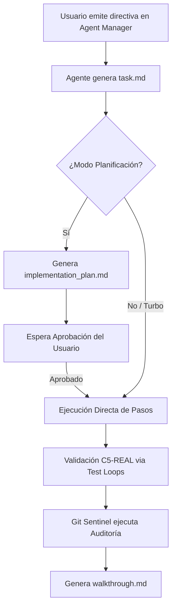

// turbo-all
# 🌌 Google Antigravity — Manual de Campo (CORTEX-Persist Edition)

> **Reality-Level:** C5-REAL | **Aesthetic:** Industrial Noir 2026 | **Engine:** Google Antigravity v2.0.6 (Build 919477694)

Antigravity opera como un sistema de **doble ventana** con agentes autónomos y ejecución nativa, alejándose del paradigma estocástico de chat tradicional. Este manual detalla la integración, seguridad, automatización y atajos avanzados dentro del ecosistema `Borja Moskv`.

---

## 🧠 1. Arquitectura de Doble Ventana y Ciclo de Vida del Agente

El flujo operativo se divide estrictamente entre la escritura de código y la orquestación del agente.

| Entorno | Atajo | Función Principal | Flujos Asociados |
|---|---|---|---|
| **Editor** | `Cmd + E` | Edición de código en caliente, refactorización inline, sugerencias contextuales. | `Cmd + I` (Instrucciones inline de código), autocompletado multi-línea con `Tab`. |
| **Agent Manager** | `Cmd + E` | Consola de control, logs en tiempo real, gestor de tareas asíncronas, visualización del Browser. | Ejecución de comandos del sistema, monitoreo de MCP, inspección de artefactos. |

### Ciclo de Ejecución de Tareas:

---

## 🌐 2. Browser Subagent (Gemini 2.5 Pro UI Checkpoint)

El subagente visual actúa como un validador causal independiente que interactúa con la interfaz de usuario de forma no intrusiva.

### Especificaciones Técnicas:
- **Sandbox Aislado:** Lanza instancias de Chrome con un perfil efímero (`--user-data-dir` temporal) sin cookies ni historial del operador.
- **Falsación Empírica:** No infiere el estado del frontend; realiza capturas reales (`.webp`) y grabaciones en video para auditar layouts y transiciones.
- **Asincronía Total:** Se ejecuta en background. El operador puede seguir editando código mientras el subagente navega y valida flujos.

### Directivas de Control:
*   **Inspección Básica:** `Ve a http://localhost:3000 y captura el estado del dashboard`
*   **Interactividad:** `Inicia sesión con credenciales de prueba, haz clic en 'Generar Reporte' y reporta si hay timeouts`
*   **Auditoría Visual (Guardian):** `Haz scroll en la landing page y busca elementos desalineados o texto superpuesto en viewports móviles`

---

## 🚦 3. Modos Operativos y Control Epistémico

| Modo | Trigger / Contexto | Comportamiento del Sistema | Criterio de Seguridad |
|---|---|---|---|
| **Planificación** | Cambios estructurales, refactors masivos de bases de datos. | Detiene la ejecución. Requiere documentación de cambios en `implementation_plan.md`. | **Bloqueo estricto:** Nada se ejecuta hasta el OK del usuario. |
| **Rápido (Turbo)** | Fixes locales, optimización JIT, tareas del pipeline CORTEX. | Ejecuta comandos y edita archivos de forma secuencial y paralela sin prompts de confirmación. | **Implícito (R9):** Asume aprobación para mantener velocidad de exergía. |

---

## 🛡️ 4. Seguridad y Sandbox del Sistema (Seatbelt)

Antigravity opera bajo un modelo de **confianza cero** mediante aislamiento nativo en macOS:

*   **Seatbelt Sandboxing:** Restricción de lectura/escritura a nivel de llamadas al sistema (syscalls). El agente solo tiene acceso al espacio de trabajo activo y `$CORTEX_ROOT/.gemini/antigravity`.
*   **Protected Paths:** Bloqueo físico a nivel de herramientas para impedir acceso a:
    - `/System/Volumes/Data/System/Library/AssetsV2`
    - `/System/Volumes/Data/private/var/db/*`
    - directorios de sincronización en la nube (CloudDocs/iCloud).
*   **Modo Estricto:** Si se activa, intercepta llamadas `run_command` destructivas (ej. `rm -rf`, reescrituras de particiones) y requiere autenticación local.

---

## 🔌 5. Ecosistema MCP (Model Context Protocol)

Antigravity amplía su contexto conectando servidores locales y remotos para interactuar de forma determinista con bases de datos e infraestructura:

*   **datacloud_alloydb_remote / datacloud_spanner_remote:** Permite a los agentes inspeccionar DDLs, ejecutar SQL de solo lectura para diagnóstico (`execute_sql_readonly`) y estructurar migraciones seguras.
*   **github:** Operaciones de control de versiones automatizadas (creación de Pull Requests, ramas, e issues) sin salir del Agent Manager.
*   **sqlite:** Sustrato local de persistencia para guardar logs y grafos de conocimiento estructurados.

---

## ⌨️ 6. Atajos de Teclado y Comandos Rápidos

| Atajo | Contexto | Acción Ejecutada |
|---|---|---|
| `Cmd + E` | Global | Alterna el foco entre el Editor de código y el Agent Manager. |
| `Cmd + I` | Editor / Terminal | Abre el prompt inline para transformaciones inmediatas de código o generación de comandos. |
| `Cmd + J` | Global | Despliega / oculta la terminal integrada del sistema. |
| `Cmd + P` | Editor | Abre la paleta de archivos, permitiendo buscar y abrir artefactos (`task.md`, etc.). |
| `Cmd + .` | Editor | Activa el menú de "Quick Fix" para resolver errores sintácticos o de linter. |
| `Tab` | Editor | Acepta sugerencias predictivas del modelo de autocompletado local. |

---

## 💡 7. CORTEX-Persist Pro Tips

1.  **Falsación preventiva con Playground:** Utiliza el entorno temporal para ejecutar scripts de prueba (`/scratch/`) antes de consolidar cambios C5-REAL en las ramas de producción.
2.  **Higiene de Tokens:** Mantén los contextos limpios ejecutando auditorías periódicas del presupuesto de tokens (`/token-hygiene`). Esto optimiza los tiempos de inferencia del orquestador.
3.  **Instrucciones Multimodales:** Si encuentras un bug visual complejo, arrastra una captura de pantalla directamente al chat con la directiva: *"Corrige el CSS para que coincida exactamente con esta referencia"*.
