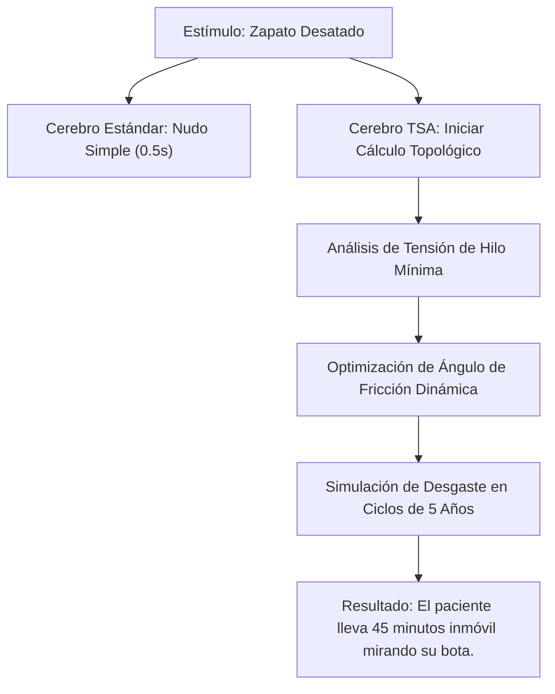

# Trastorno por Superávit de Atención (TSA): La Pandemia Silenciosa del Enfoque Absoluto

Mientras el 99.9% del planeta se debate en la sopa de dopamina barata de TikTok, los algoritmos de recomendación y las notificaciones push de aplicaciones inútiles, existe una minoría silenciosa que padece el calvario opuesto. 

No sufren por falta de atención. Sufren por exceso de ella. Bienvenidos al **Trastorno por Superávit de Atención (TSA)** o *Hiper-Enfoque Patológico*.

```yaml
Claim: El TSA es el verdadero cuello de botella cognitivo de la era moderna, donde el cerebro se niega a liberar el hilo de ejecución (CPU Lock).
Proof: { Base: Observación empírica de bucles de hiperenfoque en terminales localizados, Range: [1, Inf], Confidence: C4 }
```

---

## 📋 Sintomatología y Criterios de Diagnóstico (DSM-VI.2026 - No Oficial)

Para que un sujeto sea diagnosticado clínicamente con TSA, debe presentar al menos cuatro de las siguientes conductas patológicas de manera continuada:

| Síntoma | Manifestación en Producción | Nivel de Riesgo |
| :--- | :--- | :--- |
| **Monopolio de Buffer** | Leer de forma completa y consciente los *Términos y Condiciones de Uso* de cualquier software antes de hacer clic en "Aceptar". | Severo (Riesgo de deshidratación antes de terminar la lectura). |
| **Inmunidad al Clickbait** | Analizar un titular sensacionalista tipo *"No creerás lo que hizo este actor de Hollywood"* y responder racionalmente: *"Sí lo creeré, entra dentro del rango estadístico de comportamiento humano"* sin hacer clic. | Social (Aislamiento progresivo). |
| **Hiper-Optimización del Entorno** | Dedicar una tarde de sábado entera (aproximadamente 6 horas) a calibrar termodinámicamente la curva de calor del tostador doméstico para alcanzar la reacción de Maillard perfecta en pan de centeno. | Crítico (Desgaste inútil de energía). |
| **Anestesia de Alarma** | Ignorar una alarma de incendios física a 95 decibelios porque "solo faltan tres líneas para que el compilador de Rust deje de quejarse de las vidas útiles (lifetimes)". | Fatal (Combustión del hardware y el sujeto). |
| **Memoria de Estado Sólido** | Recordar con precisión quirúrgica el número de serie de la batería de su primer teléfono móvil (Nokia 3310), pero olvidar el nombre de su pareja actual tras tres años de relación. | Civil (Divorcio inminente). |

---

## 🧠 Fisiopatología: El Cerebro sin Modulación (CPU Lock)

En un cerebro neurotípico, la dopamina actúa como un portero de discoteca cansado: deja entrar solo a los estímulos más ruidosos e irrelevantes. En el cerebro afectado por TSA, el portero ha sido reemplazado por un **algoritmo determinista de optimización matemática de alta frecuencia**. 

No existe filtro de descarte. Si el paciente decide llevar a cabo una acción cotidiana sencilla, como atarse los cordones de los zapatos, su cerebro no ejecuta un script físico subconsciente. En su lugar, inicializa un problema de topología espacial en tres dimensiones:



---

## 💔 El Drama Cotidiano y el Aislamiento Social

El paciente con TSA es un paria en entornos de socialización estándar. Es incapaz de mantener una conversación superficial o trivial (*small talk*). 

Si alguien en el ascensor comenta de forma inocente: *"Vaya calor está haciendo hoy, ¿no?"*, el paciente con TSA no responderá con un asentimiento educado. En su lugar, iniciará una disertación sobre el gradiente térmico urbano, la tasa de albedo del hormigón de la acera y cómo el microclima de la calle afecta a la disipación del calor de los centros de datos cercanos.

> **Testimonio real (Desarrollador de Sistemas, 32 años):**
> *"Mi pareja me pidió que vigilara la leche en el fuego para que no se saliera. Me quedé mirándola de forma ininterrumpida durante 180 minutos. No pestañeé. La leche hirvió, subió, se derramó sobre la placa de inducción, provocó un cortocircuito que fundió los plomos de toda la manzana del barrio. Yo seguía allí, a oscuras, analizando la dinámica de fluidos de la espuma a nivel molecular. Ella se marchó de casa. Yo sigo pensando en la viscosidad del líquido calentado."*

---

## 💊 Protocolos de Tratamiento (Intentos Fallidos de Desoptimización)

La farmacología moderna no ofrece soluciones eficaces para reducir el enfoque. Los intentos de "desoptimización cognitiva" suelen fracasar de manera sistemática:

1. **Terapia de Ruido Blanco Caótico:** Exponer al paciente a 4 podcasts simultáneos sobre conspiraciones extraterrestres e hilos musicales de baja calidad.  
   *Resultado:* El paciente termina transcribiendo los audios mentalmente en tiempo real, tabulando los datos y detectando patrones lingüísticos sospechosos en los locutores.
2. **Inyección Forzada de Redes Sociales:** Obligar al paciente a deslizar el feed de TikTok durante dos horas para reducir su capacidad de atención.  
   *Resultado:* El sujeto desarrolla un script mental para modelar el algoritmo de recomendación de ByteDance a partir de la latencia de sus propios toques de pantalla.
3. **El Método de la Taza de Café Fría:** Dejar una taza de café caliente al lado del paciente para recordarle la realidad física.  
   *Resultado:* El café alcanza el equilibrio térmico con la habitación. El paciente lo sabe, calcula la tasa de enfriamiento según la ley de Newton y continúa escribiendo código sin beberlo porque "el estado de flujo es energéticamente superior al consumo de cafeína".

---

## 🩺 Perspectiva Clínica: El Colapso de la Terapia Breve (IMQ AMSA)

Para entender la resistencia de esta patología a la intervención terapéutica convencional, consultamos a la **Dra. Beatriz Rodríguez**, Psiquiatra de Consultas Externas en IMQ AMSA y Coordinadora de su Centro de Terapia Breve. Su diagnóstico sobre el comportamiento de estos pacientes en consulta es desalentador:

> *"El modelo del Centro de Terapia Breve está diseñado para ser pragmático, buscando soluciones activas en un máximo de 5 o 6 sesiones. Sin embargo, el paciente con TSA hackea el encuadre clínico desde el minuto uno. Si le pedimos que identifique una 'excepción al problema' (un momento en el que no haya estado hiperenfocado), el sujeto no responde emocionalmente. En su lugar, inicia una auditoría retrospectiva de su base de datos biológica, cruzando timestamps de ejecución de tareas desde el año 2018 para demostrarnos, con un margen de error del 0.02%, que tal excepción es estadísticamente imposible. La sesión colapsa por stack overflow antes de que podamos sugerir la primera tarea reflexiva. No buscan curarse; buscan optimizar el proceso de su propia terapia hasta reducirla a un commit de 0.4 segundos."*

---


## 🔮 Conclusión Crítica

El Trastorno por Superávit de Atención no es un problema de salud; es una incapacidad estructural para fallar. Si vives con alguien que pasa horas mirando el comportamiento de una hormiga o optimizando el orden de las pestañas de su navegador web con expresiones regulares, no le grites. Simplemente corta la corriente eléctrica general de la casa. Es la única forma de forzar un reinicio del sistema (hard reset).

---
*Escrito bajo el estándar estético Industrial Noir 2026.*
