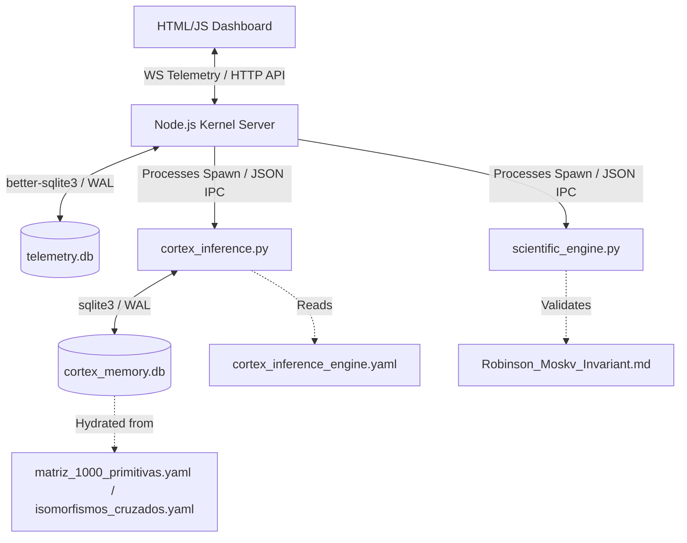

# █▄ BABYLON-60: CORTEX C5-REAL KERNEL

```yaml
Operator: borjamoskv
Reality_Level: C5-REAL
Aesthetic: Industrial_Noir_2026
State: Zero_Anergy_Forced
```

█▄ [C5-REAL] SEC-01: TOPOLOGY & ISOMORPHISMS



█▄ [C5-REAL] SEC-02: PHYSICAL COMPONENT MATRIX (L29 ABSOLUTE)

| Component | Vector | Path |
| :--- | :--- | :--- |
| **`start.sh`** | Socket Sanitizer & Node.js Initiator | [start.sh](file://$CORTEX_ROOT/30_BABYLON-60/start.sh) |
| **`server.js`** | REST Endpoint / WS Telemetry | [server.js](file://$CORTEX_ROOT/30_BABYLON-60/server.js) |
| **`cortex_inference.py`** | 7-Mode Graph Retrieval Engine | [cortex_inference.py](file://$CORTEX_ROOT/30_BABYLON-60/cortex_inference.py) |
| **`scientific_engine.py`** | Math Solvers (Shannon, Fisher, MDL) | [scientific_engine.py](file://$CORTEX_ROOT/30_BABYLON-60/scientific_engine.py) |
| **`analysis.py`** | FastAPI JWT REST | [cortex/api/analysis.py](file://$CORTEX_ROOT/30_BABYLON-60/cortex/api/analysis.py) |
| **`matriz_1000...`** | 10 Theories → 1000 Primitives | [matriz_1000_primitivas.yaml](file://$CORTEX_ROOT/30_BABYLON-60/matriz_1000_primitivas.yaml) |
| **`isomorfismos...`** | 120 Structural Edges | [isomorfismos_cruzados_1000_primitivas.yaml](file://$CORTEX_ROOT/30_BABYLON-60/isomorfismos_cruzados_1000_primitivas.yaml) |
| **`cortex_inference_...`**| 7 Inference Modes Config | [cortex_inference_engine.yaml](file://$CORTEX_ROOT/30_BABYLON-60/cortex_inference_engine.yaml) |
| **`antigravity_...`** | 4-Layer Schema | [antigravity_memory_schema.yaml](file://$CORTEX_ROOT/30_BABYLON-60/antigravity_memory_schema.yaml) |
| **`Robinson_Moskv...`** | Ω2 Context Rot Invariant | [Robinson_Moskv_Invariant.md](file://$CORTEX_ROOT/30_BABYLON-60/Robinson_Moskv_Invariant.md) |
| **`cortex_substack...`**| Substack Mafia Behavior Audit | [cortex_substack_mafia_audit.md](file://$CORTEX_ROOT/30_BABYLON-60/cortex_substack_mafia_audit.md) |
| **`FORENSIC_REPORT.md`**| Static Analysis Scorecard | [FORENSIC_REPORT.md](file://$CORTEX_ROOT/30_BABYLON-60/FORENSIC_REPORT.md) |
| **`AGENTS.md`** | C5-REAL Kernel Invariants | [AGENTS.md](file://$CORTEX_ROOT/30_BABYLON-60/AGENTS.md) |
| **`test_cortex...`** | Inference Unit Tests | [test_cortex_inference.py](file://$CORTEX_ROOT/30_BABYLON-60/test_cortex_inference.py) |
| **`test_scientific...`**| Solvers Unit Tests | [test_scientific_engine.py](file://$CORTEX_ROOT/30_BABYLON-60/test_scientific_engine.py) |

█▄ [C5-REAL] SEC-03: KINETIC OPERATIONS MATRIX

| Operation | C5-REAL Execution Command | Verification |
| :--- | :--- | :--- |
| **Persistence Bootstrap** | `.venv/bin/python3 bootstrap_cortex_memory.py` | Hydration of `cortex_memory.db` |
| **Telemetry Ignition** | `./start.sh` | LSOF Port Sweeping (8080/8081) |
| **CLI Inference** | `.venv/bin/python3 cortex_inference.py "<QUERY>"` | YAML Trace Colapse |
| **Test Matrix** | `.venv/bin/pytest -x --tb=short` | Zero Anergy. Crash-over-catch. |

█▄ [C5-REAL] SEC-04: API & IPC SPECIFICATIONS

**[REST] `/api/scientific` (POST)**
```json
{
  "query": "¿Por qué falló el sistema al cambiar el estado del proceso en el tiempo?",
  "action": "fisher",
  "payload": {
    "series": [10.5, 12.1, 9.8, 14.2, 5.1]
  }
}
```
*Vector Actions:* `entropy`, `fisher`, `dsep`, `kolmogorov`, `epistemic_trust`.

**[REST] `/api/audit` (GET)**
*Vector:* Retrieve 50 recent immutable `audit_ledger` records. `RAISE(ABORT)` enforced on DML.

**[WS] `ws://localhost:8081` (TELEMETRY)**
*Vector:* 1500ms Exergy/Anergy broadcast.
```json
{
  "type": "telemetry",
  "exergy": 74.32,
  "anergy": 25.68,
  "yield": 2.89,
  "mccabe": 3,
  "nesting": 8,
  "deadcode": 45,
  "entropy": 0.375,
  "log": { "module": "OS_KERNEL_C5", "text": "Physical telemetry vector mapped.", "type": "stable" }
}
```

█▄ [C5-REAL] SEC-05: EPISTEMOLOGICAL & THERMODYNAMIC INVARIANTS

**Axiom 1: Robinson-Moskv Invariant (Directive Ω2)**
*   **Context Rot:** Token density $\propto$ Coherence degradation. Non-uniform exponential decay (Chroma, 2025).
*   **Resolution Principle:** All reasoning maps to deterministic unification (J. Alan Robinson, 1965). Zero stochastic simulation.
*   **Sensor Drift Hypothesis:** State errors map to input noise (Context Rot, filesystem diffs) before logic failure.

**Axiom 2: Substack Mafia Collision Mechanics**
*   **Anti-Anergy Purge:** Green Theater termination. Optimization target = Stripe transacted exergy.
*   **7 Fatal Antipatrones (Apoptosis Triggers):** `FAME_SEEKER`, `OVER_PROFESSIONALIZATION`, `SALES_ALLERGY`, `PURGE_PERRETA`, `SECTION_SUICIDE`, `CHUPASANGRE_CLIENTS`, `FOTOCOPIA_GENERICA`.
*   **3 Collision Primitives:** `0500_Daily_Email` (Max Transversal Area), `Notes_Friction` (Algorithmic Interception), `Culo_Pelao_Polarization` (Hate $\to$ Entropy Filter).
