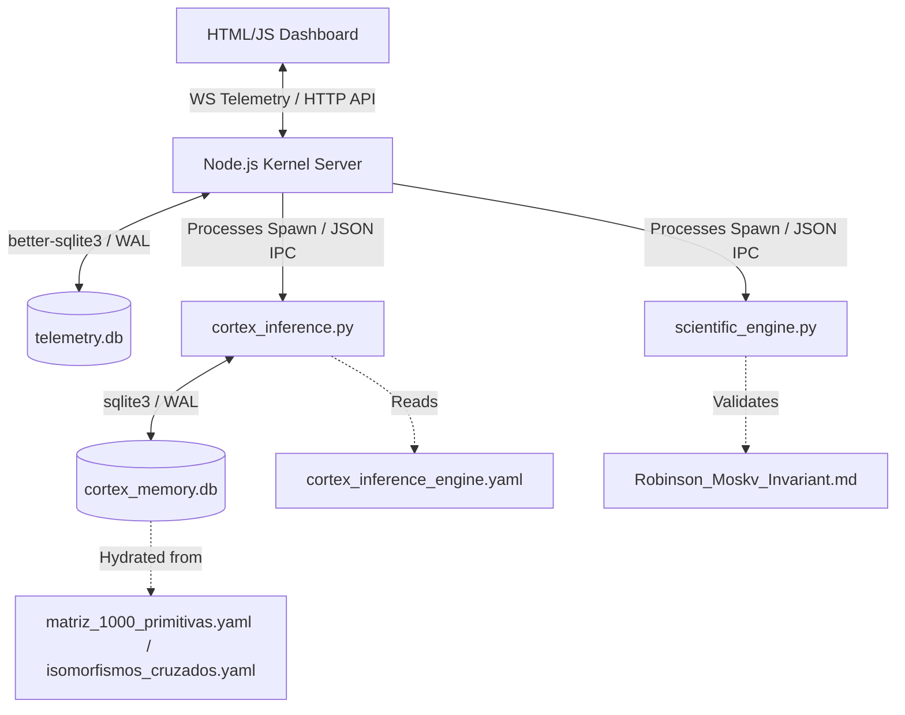

# █▄ BABYLON-60: CORTEX C5-REAL Execution Kernel

> **Reality Level:** `C5-REAL` (Physical state mutations on disk / Zero stochastic simulation)  
> **Aesthetic:** Industrial Noir 2026 (#0A0A0A / #2B3BE5 / Humanist Sans)  
> **Author:** Borja Moskv (`borjamoskv`)

---

## 1. System Topology & Architecture

BABYLON-60 represents the unified execution kernel of the CORTEX ecosystem. It integrates a real-time behavioral physics engine, logical unifications (based on Robinson's 1965 theorem), and a local-first telemetry monitor.



---

## 2. Directory of Physical Components (L29 Absolute Mapping)

*   **Execution Shells & Servers:**
    *   [start.sh](file:///Users/borjafernandezangulo/30_BABYLON-60/start.sh): Multi-port socket sanitizer and Node.js process initiator.
    *   [server.js](file:///Users/borjafernandezangulo/30_BABYLON-60/server.js): HTTP REST endpoint layer and WebSocket telemetry broadcaster.
*   **Logical & Scientific Engines:**
    *   [cortex_inference.py](file:///Users/borjafernandezangulo/30_BABYLON-60/cortex_inference.py): 7-Mode CORTEX Query Classifier & Graph Retrieval Engine.
    *   [scientific_engine.py](file:///Users/borjafernandezangulo/30_BABYLON-60/scientific_engine.py): Mathematical solvers for Shannon Entropy, Fisher Information, d-separation, and Kolmogorov Complexity.
    *   [cortex/api/analysis.py](file:///Users/borjafernandezangulo/30_BABYLON-60/cortex/api/analysis.py): Secondary FastAPI REST endpoint suite (JWT authenticated).
*   **Sovereign Data Ledgers & Configurations:**
    *   [matriz_1000_primitivas.yaml](file:///Users/borjafernandezangulo/30_BABYLON-60/matriz_1000_primitivas.yaml): Source of truth for 10 Theories mapped to 1000 Causal Primitives.
    *   [isomorfismos_cruzados_1000_primitivas.yaml](file:///Users/borjafernandezangulo/30_BABYLON-60/isomorfismos_cruzados_1000_primitivas.yaml): 120 Category Theory cross-boundary structural edges.
    *   [cortex_inference_engine.yaml](file:///Users/borjafernandezangulo/30_BABYLON-60/cortex_inference_engine.yaml): Declarative configuration for the 7 inference modes.
    *   [antigravity_memory_schema.yaml](file:///Users/borjafernandezangulo/30_BABYLON-60/antigravity_memory_schema.yaml): 4-layer database schema definition.
*   **Epistemological & Forensic Vaults:**
    *   [Robinson_Moskv_Invariant.md](file:///Users/borjafernandezangulo/30_BABYLON-60/Robinson_Moskv_Invariant.md): Theoretical foundation for Context Rot (Ω2) and J. Alan Robinson's unifications (1965).
    *   [cortex_substack_mafia_audit.md](file:///Users/borjafernandezangulo/30_BABYLON-60/cortex_substack_mafia_audit.md): Thermodynamic deconstruction of creator behavioral physics (Substack Mafia Audit).
    *   [FORENSIC_REPORT.md](file:///Users/borjafernandezangulo/30_BABYLON-60/FORENSIC_REPORT.md): System static-analysis audit scorecard.
    *   [AGENTS.md](file:///Users/borjafernandezangulo/30_BABYLON-60/AGENTS.md): Session and project invariants for C5-REAL execution kernels.
*   **Verifications & Tests:**
    *   [test_cortex_inference.py](file:///Users/borjafernandezangulo/30_BABYLON-60/test_cortex_inference.py): Unit test suite for Query Parsing and Retrieval.
    *   [test_scientific_engine.py](file:///Users/borjafernandezangulo/30_BABYLON-60/test_scientific_engine.py): Unit test suite for Shannon, Fisher, d-separation, and Kolmogorov calculations.

---

## 3. Operations & Quickstart Command Matrix

All execution runs strictly in C5-REAL within the local virtual environment `.venv`.

### 3.1 Persistence Bootstrapping
Initializes `cortex_memory.db` by parsing `matriz_1000_primitivas.yaml` and `isomorfismos_cruzados_1000_primitivas.yaml`:
```bash
.venv/bin/python3 bootstrap_cortex_memory.py
```

### 3.2 Launch Telemetry Panel
Sweeps port conflicts automatically and mounts the HTTP server (port `8080`) & WS telemetry emitter (port `8081`):
```bash
./start.sh
```
The interface is served at [http://localhost:8080](http://localhost:8080).

### 3.3 CLI Query Execution
Invokes the CORTEX Classifier to parse statements, execute topological node matching, and print output traces in YAML format:
```bash
.venv/bin/python3 cortex_inference.py "¿Por qué falló el proceso en el tiempo al cambiar el estado?"
```

### 3.4 Verification & Testing Suite
Executes all regression tests with immediate halt on failure (`-x`) and short tracebacks:
```bash
.venv/bin/pytest -x --tb=short
```

---

## 4. API & Integration Specifications

### 4.1 `/api/scientific` [POST]
Executes a full inference step + mathematical engine action and logs the results in the `audit_ledger`.
*   **Request Payload:**
    ```json
    {
      "query": "¿Por qué falló el sistema al cambiar el estado del proceso en el tiempo?",
      "action": "fisher",
      "payload": {
        "series": [10.5, 12.1, 9.8, 14.2, 5.1]
      }
    }
    ```
*   **Actions Available:**
    *   `entropy`: Compute Shannon entropy of a sequence.
    *   `fisher`: Compute Fisher information over a float array series.
    *   `dsep`: Solve d-separation on a DAG given a conditioning set.
    *   `kolmogorov`: Calculate Kolmogorov complexity via compression ratio.
    *   `epistemic_trust`: Compute trust metrics under the Asymmetric Trust Theorem.

### 4.2 `/api/audit` [GET]
Retrieves the 50 most recent immutable audit log items. Updates/deletions on this ledger trigger SQL `RAISE(ABORT)`.

### 4.3 WebSocket Telemetry [PORT 8081]
Emits telemetry packages every 1.5 seconds containing CPU load, memory usages, and computed Exergy/Anergy percentages:
```json
{
  "type": "telemetry",
  "exergy": 74.32,
  "anergy": 25.68,
  "yield": 2.89,
  "mccabe": 3,
  "nesting": 8,
  "deadcode": 45,
  "entropy": 0.375,
  "log": {
    "module": "OS_KERNEL_C5",
    "text": "Physical telemetry vector mapped. Load Avg: 0.30",
    "type": "stable",
    "metric": "85MB RSS"
  }
}
```

---

## 5. Epistemological Pillars

### 5.1 The Robinson-Moskv Invariant (Directive `Ω2`)
*   **Context Rot:** High-token density destroys coherence. Performance degrades exponentially rather than linearly with input length (validated empirically by Chroma, 2025).
*   **Rule of Resolution:** Based on J. Alan Robinson's *unification and resolution principle* (1965), all reasoning is a refutation procedure reducible to deterministic unifications, denying any validity to stochastic hallucination.
*   **Sensor Drift Hypothesis:** Any error in output state is mapped first to input channel noise (Context Rot, bad diffs, database corruption) before reasoning failure is admitted.

### 5.2 The Substack Mafia Behavioral Matrix
Translates physical systems into high-yield transactional structures:
1.  **Anti-Anergy Purge:** Stop doing "Green Theater" (seeking likes and vanity statistics). Target is Stripe transacted exergy, not GUI feedback.
2.  **The 7 Fatal Antipatrones:**
    *   `FAME_SEEKER`: Optimizing horizontal footprint instead of vertical profitability.
    *   `OVER_PROFESSIONALIZATION`: Squeezing human grit out for polished corporate mediocrity.
    *   `SALES_ALLERGY`: Hiding checkout links or apologizing for generating flow of value.
    *   `PURGE_PERRETA`: Caring about unsubscribe rates or amateur list purges.
    *   `SECTION_SUICIDE`: Fragmenting the feed before hitting scale.
    *   `CHUPASANGRE_CLIENTS`: Failing to set a "Who I don't work with" barrier.
    *   `FOTOCOPIA_GENERICA`: Cloning standard templates instead of mounting custom private knowledge bases.
3.  **The 3 Collision Primitivas:**
    *   *Daily Email (5:00 AM):* Maximum frequency to saturate target cross-section.
    *   *Notes Friction:* Hard interactions on Notes to redirect external traffic.
    *   *Polarization/Culo Pelao:* Treating hate as an entropy filter and content generator.
