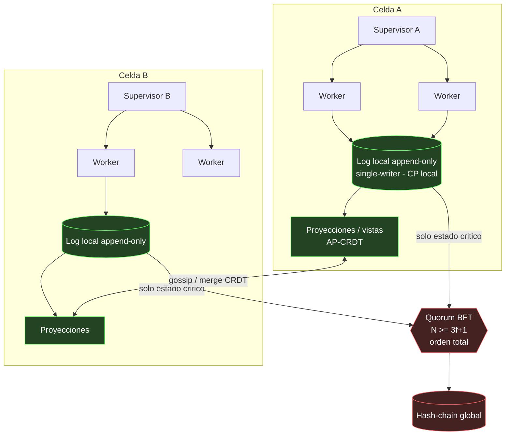

<!-- Author: Borja Moskv (SYS_ID: borjamoskv) -->

# MATRIZ 12: TOPOLOGIA DE SISTEMAS

**SYS_ID:** borjamoskv
**Clase:** Ontologia de Dominio (Arquitectura Distribuida, Tolerancia a Fallos, Consenso)
**Dominio:** No existe una "mejor topologia" en abstracto. La tactica es dejar que el invariante innegociable dicte la forma y volver estructuralmente imposible su violacion; las restricciones blandas pagan el coste. Un sistema robusto no es una topologia, son varias estratificadas por preocupacion (datos, control, aislamiento, consenso, diseminacion).

> [!NOTE]
> **Axioma de topologia:** elige UN invariante innegociable (auditabilidad, latencia o tolerancia a fallos). Construye la espina que lo hace inviolable. Pon todo lo demas en el escalon de consistencia mas barato que lo tolere. Celdas aisladas, supervision de profundidad <= 2, DAG sin ciclos, BFT minimizado y bien dimensionado (3f+1, no 3).

| Sub-matriz | Rango de IDs | Conteo |
|---|---|---|
| 12.A Catalogo de Topologias | TOP-001 .. TOP-012 | 12 |
| 12.B Invariantes de Topologia | INV-TOP-001 .. INV-TOP-012 | 12 |
| 12.C Antipatrones | ANTI-TOP-001 .. ANTI-TOP-012 | 12 |
| 12.D Redundancias Activas | RED-TOP-001 .. RED-TOP-010 | 10 |
| 12.E Procedimiento + Diagrama + Consistencia | Playbook | prosa |

---

## MATRIZ 12.A - CATALOGO DE TOPOLOGIAS

*Cada patron con su uso legitimo, su riesgo estructural y su relacion con las primitivas de la Matriz 9.*

| ID | Topologia | Estructura | Cuando Usarla | Riesgo / SPOF | Relacion con Primitivas |
|---|---|---|---|---|---|
| TOP-001 | Estrella / Hub | Un nodo central, radios a los demas. | Control simple dentro de una celda. | El hub es SPOF y cuello de botella. | Expone Post/Pinch causal (SPOF). |
| TOP-002 | Malla Completa | Todos conectados con todos. | Descentralizacion total con N pequeno. | O(n^2) enlaces; coste de consenso; acoplamiento. | Expone God-object distribuido. |
| TOP-003 | Anillo | Cada nodo enlazado a dos vecinos. | Paso de testigo, orden circular. | Una rotura parte el anillo; latencia O(n). | Fragilidad de linaje. |
| TOP-004 | DAG | Dependencias dirigidas sin ciclos. | Flujo de datos y causal. | Ninguno estructural si se mantiene aciclico. | Defiende Ciclo Causal / Interbloqueo. |
| TOP-005 | Arbol de Supervision | Supervisores que reinician o matan hijos (OTP). | Control tolerante a fallos. | Profundidad excesiva = telefono roto. | Defiende Zombificacion, Interbloqueo Recursivo. |
| TOP-006 | Celdas / Bulkheads | Particiones aisladas autosuficientes. | Acotar el blast radius. | Duplicacion de recursos por celda. | Defiende Cascada de Fallos. |
| TOP-007 | Espina de Log (Event Sourcing) | Log append-only como fuente unica; todo es proyeccion. | Auditabilidad y replay. | El log es critico; debe ser altamente disponible. | Defiende Perdida de Linaje, Split-Brain. |
| TOP-008 | Gossip / Epidemico | Diseminacion probabilistica entre pares. | Sync descentralizado, membership. | Solo consistencia eventual. | Defiende SPOF de diseminacion. |
| TOP-009 | Quorum BFT | N >= 3f+1 nodos; orden total por voto. | Estado critico bajo adversario. | Caro; bloquea en particion. | Defiende Colapso de Consenso Bizantino (PRIM-005). |
| TOP-010 | Hub-and-Spoke Jerarquico | Estrellas anidadas por niveles. | Escala organizativa. | Cada hub intermedio es un SPOF. | Pinch causal en cada hub. |
| TOP-011 | CRDT / Sin Coordinacion | Replicas que convergen por merge. | Estado AP disponible siempre. | Semantica limitada a tipos convergentes. | Defiende bloqueo por particion. |
| TOP-012 | Malla de Servicio (Sidecar) | Proxy por nodo para cross-cutting. | Observabilidad y politica uniforme. | Overhead de latencia por hop. | Defiende acoplamiento de infraestructura. |

---

## MATRIZ 12.B - INVARIANTES DE TOPOLOGIA

*Reglas que atraviesan todas las capas y no se negocian.*

| ID | Invariante | Logica / Principio | Implicacion Operacional | Condicion de Borde | Metrica Falsable |
|---|---|---|---|---|---|
| INV-TOP-001 | Aciclicidad Global | El grafo de dependencias es un DAG. | Un ciclo de control es un interbloqueo latente. | Ciclo detectado en el grafo. | Nro. de ciclos == 0. |
| INV-TOP-002 | Escritor Unico por Log | Cada log tiene exactamente un escritor. | Sin contencion de escritura ni historias rivales. | Dos escritores sobre el mismo log. | Escritores por log == 1. |
| INV-TOP-003 | Profundidad de Delegacion Acotada | La cadena de delegacion no supera 2 niveles. | Evita el efecto telefono roto causal (INV-026). | Delegacion de nivel > 2. | Profundidad maxima <= 2. |
| INV-TOP-004 | Cero Estado Compartido entre Celdas | Las celdas no comparten estado mutable. | Un fallo no cruza la frontera de celda. | Estado escrito por dos celdas. | Punteros cross-celda == 0. |
| INV-TOP-005 | Minimalidad de BFT | El orden total se reserva al estado critico. | El consenso es caro; no se usa por defecto. | Consenso sobre estado no critico. | Fraccion de estado en BFT minimizada. |
| INV-TOP-006 | Cota Bizantina 3f+1 | Tolerar f nodos maliciosos exige N >= 3f+1. | N=3 solo tolera 1 caida, no 1 nodo mentiroso. | N < 3f+1 con modelo bizantino. | N >= 3f+1 verificado. |
| INV-TOP-007 | Espina Unica de Verdad | Una fuente de verdad; el resto son proyecciones. | La RAM lee el log, no lo posee (INV-002). | Dos fuentes autoritativas. | Fuentes de verdad == 1. |
| INV-TOP-008 | Contencion de Blast Radius | Un fallo se queda en su dominio. | El aislamiento acota el dano maximo. | Fallo que se propaga entre celdas. | Celdas afectadas por fallo == 1. |
| INV-TOP-009 | Idempotencia de Mensajes | Reprocesar un mensaje no altera el estado. | Reintentos seguros; entrega at-least-once viable. | Efecto distinto al reprocesar. | Delta de segundo proceso == 0. |
| INV-TOP-010 | Backpressure Obligatorio | Todo canal tiene limite y contrapresion. | Sin colas ilimitadas que revienten la memoria. | Cola sin cota superior. | Longitud de cola acotada siempre. |
| INV-TOP-011 | Localidad de Consistencia Fuerte | CP local siempre disponible; coordinacion solo si el orden cruza nodos. | Escritura local sin bloqueo global. | Coordinacion global para estado local. | Latencia de escritura local sin quorum. |
| INV-TOP-012 | Simetria de Conway | La topologia del sistema refleja la de los agentes. | Fronteras de modulo = fronteras de equipo/agente (INV-030). | Modulo transversal a varios equipos. | Modularidad del grafo de dependencia. |

---

## MATRIZ 12.C - ANTIPATRONES

*Topologias mal aplicadas que inyectan anergia estructural.*

| ID | Antipatron | Disfuncion Causal | Senal de Presencia | Impacto en Robustez | Refactor (Alternativa) |
|---|---|---|---|---|---|
| ANTI-TOP-001 | Hub en la Via Critica | Todo el trafico critico pasa por un nodo central. | Estrella pura sobre el camino principal. | SPOF y cuello de botella (pinch causal). | Replicar el hub o pasar a DAG/celdas. |
| ANTI-TOP-002 | Dependencias Ciclicas | El grafo de dependencias contiene ciclos. | A depende de B que depende de A. | Interbloqueo y arranque imposible. | Romper el ciclo; inyeccion de dependencias DAG. |
| ANTI-TOP-003 | BFT en Todas Partes | Consenso de orden total donde no hace falta. | Quorum para cachear o para estado local. | Latencia y coste x N sin beneficio. | Acotar BFT al estado critico. |
| ANTI-TOP-004 | N=3 para Bizantino | Quorum insuficiente para un adversario malicioso. | Se llama BFT a un cluster de 3 nodos. | Un nodo mentiroso rompe el consenso. | N >= 3f+1 (4 para f=1). |
| ANTI-TOP-005 | Estado Compartido entre Celdas | Celdas que comparten una base de datos mutable. | Acoplamiento oculto por estado comun. | Un fallo cruza el bulkhead (cascada). | Estado por celda; comunicacion por mensajes. |
| ANTI-TOP-006 | Delegacion Profunda | Cadenas de delegacion de mas de 2 niveles. | Subagente que delega que delega. | Telefono roto causal; latencia y perdida. | Aplanar a profundidad <= 2. |
| ANTI-TOP-007 | Monolito Distribuido | Microservicios acoplados sincronicamente en todo. | Un cambio obliga a desplegar varios servicios. | Peor que el monolito: fragil y lento. | Limites por Conway; acoplamiento asincrono. |
| ANTI-TOP-008 | Malla Chismosa | Servicios que se llaman en O(n^2) sincronicamente. | Cascadas de llamadas sincronas entre pares. | Amplificacion de latencia y de fallos. | Event-driven; agregacion; backpressure. |
| ANTI-TOP-009 | Fuente de Verdad Dual | Dos logs o BDs autoritativos del mismo estado. | Sincronizacion bidireccional ad-hoc. | Split-Brain garantizado bajo particion. | Una espina de log; el resto proyecciones. |
| ANTI-TOP-010 | Sin Backpressure | Canales y colas sin limite superior. | Productor mas rapido que el consumidor. | OOM en cascada bajo carga. | Colas acotadas; control de flujo; drop/limit. |
| ANTI-TOP-011 | Reintento Ciego | Reintentos sin backoff ni circuit breaker. | Bucle de retry inmediato ante fallo. | Tormenta de reintentos (DDoS accidental). | Backoff exponencial + circuit breaker (PRIM-049). |
| ANTI-TOP-012 | Consistencia Uniforme | Tratar todo el estado con una sola clase (todo CP o todo AP). | Misma politica para cache y para dinero. | O lento de mas, o inconsistente de mas. | Clases de consistencia por pieza de estado. |

---

## MATRIZ 12.D - REDUNDANCIAS ACTIVAS (MITIGACION C5)

*Mecanismos estructurales de tolerancia. RED-TOP-001/002/003 son la trinidad base: espina, supervision, aislamiento.*

| ID | Redundancia C5 | Funcion Topologica | Riesgo Mitigado | Coste (Overhead) | Dependencias |
|---|---|---|---|---|---|
| RED-TOP-001 | Espina de Event Sourcing | Log append-only como unica fuente de verdad; todo se reconstruye por replay. | Perdida de linaje, Split-Brain, estado divergente. | Almacenamiento del log; snapshots periodicos. | Log store append-only. |
| RED-TOP-002 | Arbol de Supervision + Apoptosis | Supervisores que detectan, reinician o matan hijos podridos. | Zombificacion, Interbloqueo Recursivo. | Un thread de monitoreo por supervisor. | Runtime de actores/OTP. |
| RED-TOP-003 | Bulkheads por Celda | Aisla dominios de fallo autosuficientes. | Cascada de fallos; blast radius amplio. | Duplicacion de recursos por celda. | Particion de estado y despliegue. |
| RED-TOP-004 | BFT Acotado | Orden total por quorum solo para el estado critico. | Colapso de Consenso Bizantino (PRIM-005). | Latencia de quorum; N >= 3f+1 nodos. | Protocolo BFT (PBFT/HotStuff). |
| RED-TOP-005 | Merge CRDT | Convergencia de replicas sin coordinacion. | Bloqueo por particion; conflictos de escritura. | Metadatos de version por objeto. | Tipos de datos convergentes. |
| RED-TOP-006 | Anti-Entropia por Gossip | Reconciliacion periodica del estado entre pares. | Deriva de estado; SPOF de diseminacion. | Trafico de fondo constante. | Protocolo de gossip. |
| RED-TOP-007 | Circuit Breaker | Corta las llamadas a una dependencia caida. | Cascada de timeouts; agotamiento de hilos. | Estado del breaker; ventana de prueba. | Cliente con estado de fallo. |
| RED-TOP-008 | Backpressure / Control de Flujo | Propaga la saturacion hacia atras para frenar al productor. | OOM por colas ilimitadas. | Reduccion de throughput bajo carga. | Canales acotados. |
| RED-TOP-009 | Quorum de Lectura/Escritura | R + W > N garantiza solape de lecturas y escrituras. | Lecturas estales; escritura perdida. | Latencia proporcional al quorum. | Almacen replicado con versiones. |
| RED-TOP-010 | Health-Check + Failover | Detecta nodos caidos y transfiere su rol. | Indisponibilidad por fallo de nodo. | Heartbeats; posible flapping. | Monitor de salud, election de lider. |

---

## MATRIZ 12.E - PROCEDIMIENTO, DIAGRAMA Y CLASES DE CONSISTENCIA

### Procedimiento de decision (ejecutable, en orden)

1. **Nombra un solo invariante innegociable** (auditabilidad, latencia o tolerancia a fallos). Si no puedes elegir uno, ese es el primer bug de diseno.
2. **Elige la espina que lo vuelve inviolable:** auditabilidad -> log inmutable; integridad -> quorum; latencia -> edge/local.
3. **Clasifica cada pieza de estado** en CP-orden-total / CP-local / AP-CRDT. Minimiza la primera.
4. **Dimensiona celdas por dominio de fallo:** la unidad mas pequena que puede morir sola. Cero estado compartido entre celdas.
5. **Cablea control como arbol de supervision (prof. <= 2); datos como DAG de proyecciones.** Cero ciclos.
6. **Escala BFT solo al set CP-orden-total**, con N >= 3f+1.

### Topologia de referencia

### Parametros concretos

| Parametro | Valor | Por que | Defiende |
|---|---|---|---|
| Escritores por log | 1 (single-writer) | Sin contencion ni historias rivales | Colision de Escritura; Split-Brain |
| Profundidad de delegacion | <= 2 | Evita el telefono roto causal | INV-026 / INV-TOP-003 |
| Quorum bizantino | N >= 3f+1 (f=1 -> 4) | N=3 solo tolera 1 caida, no 1 nodo malicioso | PRIM-005 Colapso BFT |
| Alcance de BFT | minimo posible | El consenso es anergia cara | Consenso innecesario |
| Estado compartido entre celdas | 0 | Acota el blast radius | Cascada de fallos |
| Grafo de dependencias | DAG (0 ciclos) | Un ciclo es un interbloqueo latente | Ciclo Causal / Interbloqueo |

### Clases de consistencia (resolucion CAP / PACELC)

| Clase | Que va aqui | Coste | Mecanismo |
|---|---|---|---|
| CP orden-total | Dinero, cabeza del hash-chain, commits de seguridad | Alto (bloquea en particion) | BFT N >= 3f+1 |
| CP local | El log propio de cada nodo | Bajo (sin coordinacion) | Single-writer append-only |
| AP / CRDT | Caches, presencia, vistas, anotaciones | Casi nulo | CRDT convergente |

Regla: por defecto **AP-CRDT**; sube a **CP-local** cuando el orden importa dentro del nodo; sube a **BFT-orden-total** solo cuando el desacuerdo entre nodos es catastrofico. Cada escalon se justifica por escrito. En PACELC: **PA/EL** para casi todo, **PC/EC** solo para el sliver critico.

**Tactica en una frase:** un invariante innegociable, una espina que lo hace inviolable, y todo lo demas en el escalon de consistencia mas barato que lo tolere.

> [!CAUTION]
> **LEY DE DUPLICACION ONTOLOGICA (ANTI-005):** SSoT. Toda expansion se inyecta por diff sobre este archivo.
