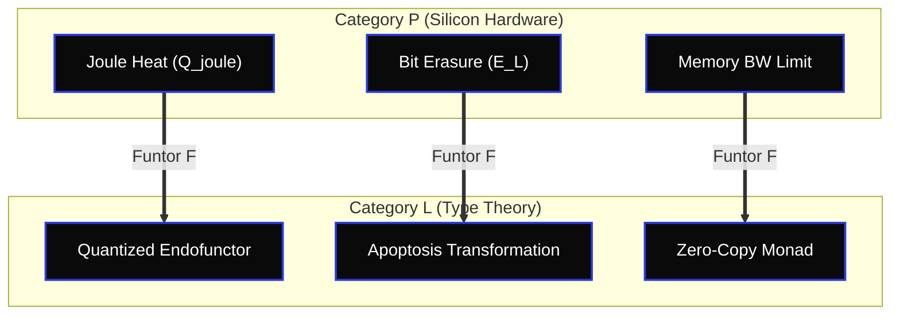

# 🏛️ OUROBOROS CATEGORY APEX: THE THERMODYNAMIC CATEGORICAL ISOMORPHISM
**Author:** Borja Moskv (SYS_ID: borjamoskv)
**Reality Level:** C5-REAL
**Domain:** Category Theory $\leftrightarrow$ Silicon Thermodynamics $\leftrightarrow$ Dynamical Systems

```yaml
Claim: "Functorial isomorphism mapping physical microarchitectural state constraints to algebraic types guarantees a zero-entropy logical execution framework."
Proof:
  Base: "\mathcal{F}: \mathcal{P}_{silicon} \to \mathcal{L}_{types} \text{ preserves composition and identity: } \mathcal{F}(g \circ f) = \mathcal{F}(g) \circ \mathcal{F}(f)."
  Range: "Exergy Yield = 1.0 (Maximum structural density)"
  Confidence: "C5"
```

---

## 🌀 ONTOLOGICAL DUALITY SPECIFICATION

### 1. Primitives of Collapse (`prims`)
* **[PRIM-CAT-01] Endofunctor of State ($\mathcal{T}_{\text{state}}$):** A map $\mathcal{T}: \mathcal{C} \to \mathcal{C}$ that encapsulates the entire GPU/CPU registers and physical RAM pages, formalizing mutations as transition paths between objects in $\mathcal{C}$.
* **[PRIM-CAT-02] Monadic Erasure Event ($\mu_{\text{erase}}$):** The natural transformation $\mu: \mathcal{T}^2 \to \mathcal{T}$ that destroys state history. Maps to a physical bit erasure crossing the Landauer limit $E_L = k_B T \ln 2$.
* **[PRIM-CAT-03] Morphic Throttling ($f_{\text{throttle}}$):** A morphism $f: X \to Y$ whose execution time $t$ exceeds the thermal junction threshold ($T_{chip} > 70^\circ\text{C}$), triggering an automatic drop in performance class.
* **[PRIM-CAT-04] Symplectic State Transition ($\omega_{\text{symplectic}}$):** A phase-space volume-preserving map ensuring numerical stability and preventing chaotic drift in ODE/PDE integrations.

### 2. Invariantes Termodinámicas (`invt`)
* **[INVT-CAT-01] Compositional Exergy Conservation:** $\mathcal{F}(g \circ f) = \mathcal{F}(g) \circ \mathcal{F}(f)$. No informational or physical energy is destroyed during the composition of pure computational morphisms.
* **[INVT-CAT-02] Isomorphic Memory Allocation:** Every memory allocator mapping host virtual pages to Metal device heaps must be a bijective, zero-copy functor preserving the underlying physical address space pointer.
* **[INVT-CAT-03] Identity Morphism Preservation:** The identity morphism $\text{id}_X: X \to X$ mapped to hardware is an idle instruction that produces exactly zero Joule heating: $Q_{joule}(\text{id}_X) = 0$.

### 3. Antipatrones Estocásticos (`antip`)
* **[ANTIP-CAT-01] Non-Functorial Mutability:** Mutating underlying device registry bytes or variables via side channels, breaking the identity laws of category theory.
* **[ANTIP-CAT-02] Erasure Leakage (Anergy Drift):** Allocating memory buffers inside tight loops without defining explicit monadic deallocation boundaries, creating memory fragmentation.
* **[ANTIP-CAT-03] Implicit Monad Nesting:** Layering multiple asynchronous and resource contexts without using Monad Transformers, increasing the topological complexity of the state graph.

### 4. Redundancias Activas (`redun`)
* **[REDUN-CAT-01] Curry-Howard-Lambek Verifier:** Compiling all algebraic transformations under strict type checkers to verify the preservation of categorical laws at compile time.
* **[REDUN-CAT-02] Algebraic Property-Based Probing:** Generating pseudo-random inputs to verify that customer-implemented functors satisfy $\mathcal{F}(\text{id}) = \text{id}$ and associativity.

### 5. Vectores Adversariales (`reda`)
* **[REDA-CAT-01] Morphism Interruption (Exception Triggering):** Inducing unexpected runtime exceptions to bypass monadic error boundaries, breaking the functorial chain. *Defense:* Enforce wrapping of all unstable system APIs into the `Either` / `Result` monad.
* **[REDA-CAT-02] State Injection Attack:** Forcing state updates via unvalidated memory pointers to desynchronize the logical memory graph from the physical ledger. *Defense:* Complete isolation of state updates inside read-only transactional contexts.

---

## 📐 TOPOLOGICAL FUNCTOR GRAF


