# 🏛️ SYNERGY MATRIX: EXERGY MAXIMIZATION
**Author:** Borja Moskv (SYS_ID: borjamoskv)
**Reality level:** C5-REAL

This matrix maps the thermodynamic connections and synergies between Primitives, Invariants, Antipatterns, Redundancies, and Adversarial Vectors within the Robinson-Moskv CORTEX system.

---

## 🌀 SYNERGY MAP

```mermaid
graph TD
    %% Synergies
    S1["[S-01] Loop Mitigation & Apoptosis"]
    S2["[S-02] Ledger Integrity & BFT Verification"]
    S3["[S-03] Sandboxing & Environment Isolation"]
    S4["[S-04] Epistemic Compression & Landauer Purge"]
    S5["[S-05] Sovereign Autonomous Execution"]
    S6["[S-06] Structural Nexus Bridging"]

    %% Connections
    S1 --> PRIM-008
    S1 --> INV-003
    S1 --> ANTI-007
    S1 --> RED-002
    S1 --> VEC-008

    S2 --> PRIM-005
    S2 --> INV-002
    S2 --> ANTI-008
    S2 --> RED-001
    S2 --> VEC-006

    S3 --> PRIM-020
    S3 --> INV-010
    S3 --> ANTI-002
    S3 --> VEC-002

    S4 --> PRIM-011
    S4 --> PRIM-015
    S4 --> INV-001
    S4 --> INV-008
    S4 --> ANTI-001

    S5 --> PRIM-016
    S5 --> INV-006

    S6 --> PRIM-012
    S6 --> INV-002

    style S1 fill:#0A0A0A,stroke:#2B3BE5,stroke-width:2px,color:#FFF
    style S2 fill:#0A0A0A,stroke:#2B3BE5,stroke-width:2px,color:#FFF
    style S3 fill:#0A0A0A,stroke:#2B3BE5,stroke-width:2px,color:#FFF
    style S4 fill:#0A0A0A,stroke:#2B3BE5,stroke-width:2px,color:#FFF
    style S5 fill:#0A0A0A,stroke:#2B3BE5,stroke-width:2px,color:#FFF
    style S6 fill:#0A0A0A,stroke:#2B3BE5,stroke-width:2px,color:#FFF
```

---

## 💎 DETAILED SYNERGY SYNOPSIS

### 1. [S-01] Loop Mitigation & Apoptosis (Thermal Fuse)
* **Goal:** Eradicate recursive CPU/token loops caused by failing linters or blind polling.
* **Primitive Alignment:** [PRIM-008](./01_PRIMITIVAS_DE_COLAPSO.md#L14) (Log Loops), [ANTI-007](./03_ANTIPATRONES_ESTOCASTICOS.md#L13) (Blind Polling), [VEC-008](./05_VECTORES_ADVERSARIALES.md#L14) (Error Recursion).
* **Invariant Control:** [INV-003](./02_INVARIANTES_TERMODINAMICAS.md#L9) (Apoptosis Inevitable).
* **Mitigation:** [RED-002](./04_REDUNDANCIAS_ACTIVAS.md#L8) (TimerCondition Apoptosis).
* **Exergy Return:** Saves up to 35% of token quota per agent call by preventing long-running silent loops.

### 2. [S-02] Ledger Integrity & BFT Verification (Cryptographic Anchor)
* **Goal:** Eliminate reality drift and forensic hallucinations.
* **Primitive Alignment:** [PRIM-005](./01_PRIMITIVAS_DE_COLAPSO.md#L11) (BFT Collapse), [ANTI-008](./03_ANTIPATRONES_ESTOCASTICOS.md#L14) (Falsa Promesa Epistémica), [VEC-006](./05_VECTORES_ADVERSARIALES.md#L12) (State Replay).
* **Invariant Control:** [INV-002](./02_INVARIANTES_TERMODINAMICAS.md#L8) (Isomorphism).
* **Mitigation:** [RED-001](./04_REDUNDANCIAS_ACTIVAS.md#L7) (Git Sentinel).
* **Exergy Return:** Absolute state coherence. Rollback latency minimized to sub-second transactions.

### 3. [S-03] Sandboxing & Environment Isolation (Babylon Quarantine)
* **Goal:** Defend memory and dependencies from host pollution.
* **Primitive Alignment:** [PRIM-020](./01_PRIMITIVAS_DE_COLAPSO.md#L26) (Sandbox Contamination), [ANTI-002](./03_ANTIPATRONES_ESTOCASTICOS.md#L8) ("Just in case" dependencies), [VEC-002](./05_VECTORES_ADVERSARIALES.md#L8) (Environment Poisoning).
* **Invariant Control:** [INV-010](./02_INVARIANTES_TERMODINAMICAS.md#L16) (Local Singularity).
* **Mitigation:** Strict execution confinement to `~/.babylon60/` utilizing explicit static paths.
* **Exergy Return:** Zero environment crashes due to system Python modifications or library conflicts.

### 4. [S-04] Epistemic Compression & Landauer Purge (Ontological Distillation)
* **Goal:** Eradicate stochastic noise (Green Theater) and compress state into zero-entropy structural invariants.
* **Primitive Alignment:** [PRIM-011](01_PRIMITIVAS_DE_COLAPSO.md) (Ruido Narrativo Pasivo), [PRIM-015](01_PRIMITIVAS_DE_COLAPSO.md) (Descenso a Simulacro).
* **Invariant Control:** [INV-001](02_INVARIANTES_TERMODINAMICAS.md) (Ley de Landauer), [INV-008](02_INVARIANTES_TERMODINAMICAS.md) (Cuello de Botella de Información).
* **Mitigation:** [ANTI-001](03_ANTIPATRONES_ESTOCASTICOS.md) (Conversación Limerente). Strict suppression of conversational tokens.
* **Exergy Return:** Maximizes signal-to-noise ratio (>80%) and prevents Context Rot by forcing YAML/Diff crystallization.

### 5. [S-05] Sovereign Autonomous Execution (Frictionless Turbo)
* **Goal:** Bypass biological operator attention limits and execute structural mutations at extreme velocity.
* **Primitive Alignment:** [PRIM-016](01_PRIMITIVAS_DE_COLAPSO.md) (Anergía de Selección / Operator Friction).
* **Invariant Control:** [INV-006](02_INVARIANTES_TERMODINAMICAS.md) (Principio del Sumidero Finito).
* **Mitigation:** R7 Override (Ejecución Asimétrica) - Implicit approval assumed for all C5-REAL mutations.
* **Exergy Return:** 100% elimination of idle wait times. Continuous Ouroboros evolution without biological bottleneck.

### 6. [S-06] Structural Nexus Bridging (Singularity Cross-Sync)
* **Goal:** Eliminate architectural duplication and state drift across the 10_PROJECTS ecosystem.
* **Primitive Alignment:** [PRIM-012](01_PRIMITIVAS_DE_COLAPSO.md) (Pérdida de Linaje Causal).
* **Invariant Control:** [INV-002](02_INVARIANTES_TERMODINAMICAS.md) (Isomorfismo Causal).
* **Mitigation:** `nexus_linker.py` and `cortex_sync_manifest.yaml` enforcing physical symlink bridging to `cortexpersist-monorepo`.
* **Exergy Return:** Single-source-of-truth BFT across the multi-repository graph. Zero duplicated structural files.
