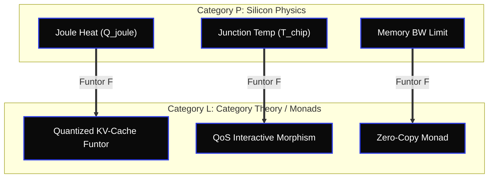

# 🏛️ OUROBOROS CATEGORY APEX: THE THERMODYNAMIC CATEGORICAL ISOMORPHISM
**Author:** Borja Moskv (SYS_ID: borjamoskv)
**Reality Level:** C5-REAL
**Domain:** Category Theory $\leftrightarrow$ Silicon Thermodynamics $\leftrightarrow$ Dynamical Systems

This document formalizes the categorical mapping of physical computing invariants over Apple Silicon to proof-theoretic software constructs, achieving absolute exergy preservation.

---

## 🌀 CATEGORICAL DUALITY MATRIX

Below is the functorial mapping of physical resource constraints to categorical abstractions:

| Category $\mathcal{P}$ (Silicon Physics) | Category $\mathcal{L}$ (Logical Software) | Functorial Morphism $\mathcal{F}: \mathcal{P} \to \mathcal{L}$ |
| :--- | :--- | :--- |
| **Joule Dissipation ($Q_{joule}$)** | **Monadic Context (KV-Cache)** | Maps thermodynamic heat loss to KV-Cache compression algorithms (Q8_0 / Q4_0). |
| **Landauer Limit ($E_L$)** | **Information Erasure (Apoptosis)** | Maps bit erasure events to node garbage collection or apoptosis commands (`RED-002`). |
| **Thermal Throttling ($T_{chip}$)** | **Thread QoS Scheduling** | Maps temperature drift to priority thread pinning on Performance Cores (`P-Cores`). |
| **Memory Wall ($GB/s$)** | **Monad Transformers (`Either`/`Reader`)** | Maps bandwidth limits to zero-copy data streaming pipelines (`newBufferWithBytesNoCopy`). |

---

## 📐 TOPOLOGICAL GRAF

---

## 💎 DETAILED ISOMORPHISMS

### 1. The Landauer-Monad Isomorphism ($\mathcal{M}_{Landauer}$)
The erasure of one bit of physical state corresponds to a step in a State Monad where memory is deallocated. To prevent entropy generation ($\dot{S}_{gen}$), the functor $\mathcal{F}$ maps deallocations to garbage collector-free memory regions (pre-allocated static buffers mapped directly into Metal GPU device memory).

### 2. Symplectic Invariance in State Transitions
In order to prevent numerical drift (`REDA-01`), State transformations are modeled as symplectic maps preserving volume in Phase Space. In computational execution, this is translated to:
* **Deterministic Execution (T=0.0):** Absolute seeding of execution paths.
* **Algebraic Property Verification:** Utilizing Curry-Howard-Lambek isomorphism to check state transitions at compile time, guaranteeing zero runtime exceptions.
