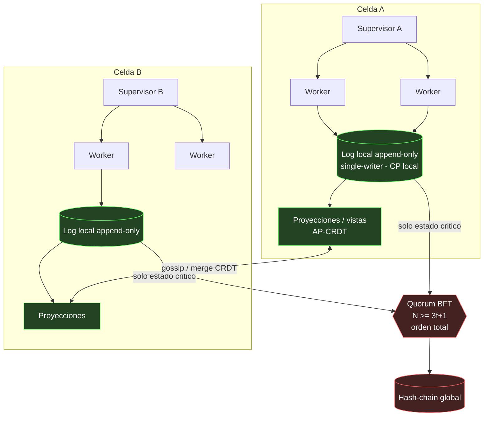

# DIMENSION: Ontologia de Dominio (Topologia de Sistemas y Consenso BFT)

SYS_ID: borjamoskv
Dominio: El diseño de topologías resilientes debe cristalizarse en un playbook decidible y asimétrico. Todo sistema debe anclar un invariante innegociable y mapear su estado físico en tres niveles estrictos (CP-orden-total, CP-local, AP-CRDT). Las celdas operan con aislamiento de fallo (blast radius = 0), árboles de supervisión de profundidad ≤ 2 y proyecciones DAG sin ciclos. Tolerancia bizantina exige N ≥ 3f+1, donde la anergía de coordinación se restringe exclusivamente al estado de riesgo existencial.

> [!NOTE]
> Corrección BFT (INV-TOP-005): El quórum N=3 solo provee tolerancia ante caídas (f=1 en crash-fault, ej. Raft/Paxos), pero carece de tolerancia ante actores maliciosos (Byzantine). Tolerancia a fallos bizantinos f=1 requiere estrictamente N ≥ 3f+1 → 4 nodos.

## Procedimiento de Colapso Topológico

1. **Invariante Único**: Nombra un solo invariante innegociable (auditabilidad *o* latencia *o* tolerancia a fallos). Si no puedes elegir uno, es un bug de diseño, no de topología.
2. **Espina Causal**: Elige la restricción física que lo vuelve imposible de violar (auditabilidad → log inmutable; integridad → quórum; latencia → edge/local).
3. **Clasificación CAP Decidible**: Minimiza el conjunto CP-orden-total (estado catastrófico); escala AP-CRDT (local-first).
4. **Dominio de Fallo Aislado**: Celdas dimensionadas como unidad atómica mínima de defunción. Cero estado compartido inter-celda.
5. **DAG de Proyecciones**: Cablea el control como árbol de supervisión (prof. ≤ 2) y los datos como DAG de proyecciones. Cero ciclos (evita interbloqueo latente).
6. **BFT Acotado**: Restringe N ≥ 3f+1 estrictamente al subconjunto CP-orden-total.

## Topología de Referencia C5-REAL

## Parámetros Termodinámicos y Mapeo a Primitivas

| Parámetro | Valor | Justificación Termodinámica | Defiende (Primitiva/Matriz 9) |
| :--- | :--- | :--- | :--- |
| Escritores por log | 1 (single-writer) | Sin contención ni historias rivales | Colisión de Escritura; Split-Brain Causal |
| Profundidad de delegación | ≤ 2 | Evita el "teléfono roto" causal | INV-026 |
| Quórum bizantino | **N ≥ 3f+1** (f=1 → **4**) | N=3 solo tolera crash, no malicioso | PRIM-005 Colapso BFT |
| Alcance de BFT | Mínimo posible | El consenso es anergía extrema y cara | Consenso innecesario |
| Estado compartido entre celdas | 0 | Acota el blast radius de la muerte celular | Cascada de fallos |
| Grafo de dependencias | DAG (0 ciclos) | Un ciclo es un interbloqueo (deadlock) latente | Ciclo Causal / Interbloqueo |

## Clases de Consistencia (Resolución CAP Decidible)

| Clase CAP | Contenido Ontológico | Coste Físico (Exergía) | Mecanismo C5-REAL |
| :--- | :--- | :--- | :--- |
| **CP orden-total** | Dinero, cabeza del hash-chain, commits de seguridad | Alto (bloquea el sistema en partición) | BFT N ≥ 3f+1 |
| **CP local** | El log propio de cada nodo, secuencias asimétricas | Bajo (sin fricción de coordinación de red) | Single-writer append-only |
| **AP / CRDT** | Cachés, presencia, vistas, anotaciones ligeras | Casi nulo (convergencia optimista local) | CRDT convergente |

> [!TIP]
> Regla de Enrutamiento CAP PACELC: **Por defecto CRDT-AP; sube a CP-local cuando el orden importa dentro del nodo; sube a BFT-orden-total solo cuando el desacuerdo entre nodos es catastrófico.** Justifica por escrito todo ascenso en el escalón. (PA/EL por defecto; PC/EC como excepción táctica).

## Táctica en una Frase (La Invariante)

**Un invariante innegociable → una espina que lo vuelve imposible de violar → todo lo demás en el escalón de consistencia más barato que lo tolere.** (Celdas aisladas, supervisión ≤ 2, DAG sin ciclos, BFT minimizado a N ≥ 3f+1).

## Sub-matrices
| Sub-matriz | Rango de IDs | Conteo |
| :--- | :--- | :--- |
| 12.A Primitivas Topológicas | PRIM-TOP-001 .. PRIM-TOP-050 | 50 |
| 12.B Invariantes C5 | INV-TOP-001 .. INV-TOP-050 | 50 |
| 12.C Antipatrones Estructurales| ANTI-TOP-001 .. ANTI-TOP-020 | 20 |
