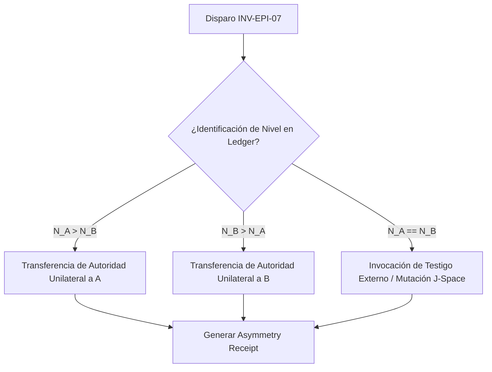

# C5-REAL PROTOCOLO DE CONSENSO ANTE ASIMETRÍA EPISTÉMICA

█▄ AUDIT_L4: BFT EPISTEMIC CONFLICT RESOLUTION ▄█

## 1. EL DIAGNÓSTICO DE CRUCE DE EJES

El *Corolario de Desacuerdo (Zero-Anergy Dispute)* establece que la fricción argumental prolongada entre dos nodos de alta capacidad no es factual (Layer 1), sino topológica ($N_k$ vs $N_{k+j}$). 

### [INV-EPI-07] CONDICIÓN DE DETECCIÓN DE ASIMETRÍA
El sistema declara un conflicto por asimetría epistémica cuando se satisfacen simultáneamente las siguientes condiciones:
1. **Evidencia Unificada (Factual Match):** Ambos agentes leen la misma entrada física y comparten la misma base de hechos verificados criptográficamente:
   $$H(A) = H(B)$$
2. **Divergencia de Acción (Semantic Drift):** Las acciones o recomendaciones del colapso del AST divergen:
   $$	ext{Action}_A 
eq 	ext{Action}_B$$
3. **Inercia de Tokens:** El intercambio supera los 3 ciclos iterativos de confrontación local sin que los hashes lógicos converjan, lo que indica un consumo inútil de ATP biológico o tokens (Anergía).

---

## 2. PROTOCOLO DE DESESCALADO Y RESOLUCIÓN (BFT-ASIMÉTRICO)

Cuando se dispara la condición `[INV-EPI-07]`, el orquestador aborta la reentrada de hechos y ejecuta la jerarquía de niveles de Vázquez de forma atómica:



### Reglas de Mediación Física
1. **Poda de Discusión (Anergia Purge):** Queda estrictamente prohibido permitir que un nodo de menor jerarquía ($N_k$) exija justificaciones detalladas a un nodo de mayor jerarquía ($N_{k+j}$) sobre el cual es cognitivamente ciego. El orquestador silencia el canal de debate factual.
2. **Transición Unilateral de Decisión:** El nodo con la cota de nivel superior ($N_{upper}$) asume el control absoluto de la rama de ejecución. Sus pesos latentes dictan la acción final.
3. **Receipt Obligatorio:** Todo colapso de asimetría debe emitir un recibo criptográfico en disco conteniendo la justificación del nivel asignado:
   ```json
   {
     "event": "epistemic_asymmetry_resolution",
     "winner_node": "agent_id_A",
     "level_difference": 2,
     "timestamp": "2026-07-11T02:04:40Z"
   }
   ```

---

## 3. INTEGRACIÓN CON M12 (TOPOLOGÍA DE CONSENSO)
Este protocolo formaliza el paso del nivel **CP-local single-writer (Escalón 2)** a la mediación de **Testigo Externo (Escalón 3)** cuando la fricción amenaza la invarianza del sistema. La asimetría no se discute; se mide a través del diferencial termodinámico del AST.
