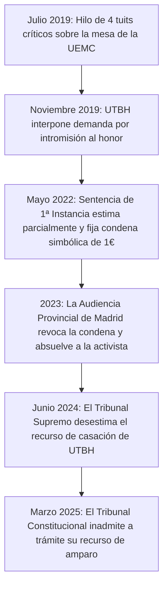

# LA ANATOMÍA DE LA ANERGÍA VERIFICADA: DECONSTRUCCIÓN FORENSE DE UN TÍO BLANCO HETERO

**La termodinámica del cinismo transaccional y la asimetría moral del victimismo corporativo.**

█▄

## INTRODUCCIÓN: LA TERMODINÁMICA DE LA INDIGNACIÓN EN LA BANDA ANCHA

En la economía de la atención de 2026, el recurso más escaso no es el almacenamiento de datos ni la capacidad de procesamiento de los centros de cálculo, sino la atención biológica del Operador humano. Cuando un sistema disipa esta atención en dinámicas estocásticas que no generan trabajo útil ni mutación estructural del conocimiento, estamos ante un proceso de pura **Anergía**. 

Pocas figuras ejemplifican este sumidero de entropía psíquica con tanta precisión quirúrgica como Sergio Candanedo, conocido en el teatro de internet bajo el avatar corporativo de *Un Tío Blanco Hetero (UTBH)*. 

El modelo de negocio de UTBH no reside en la producción de ideas, en el análisis formal de los sistemas de control o en la creación de herramientas de autonomía cognitiva. Reside en el **proxenetismo atencional**: la conversión sistemática de la bilis moral y el resentimiento reactivo de una demografía específica en ingresos recurrentes a través de pasarelas de pago. La tesis que vertebra esta autopsia es simple: el cinismo no es una postura filosófica; es la optimización fiscal de quien descubre que la indignación ajena es infinitamente más fácil de monetizar que la competencia técnica.

---

## ACTO I: EL MITO DE LA CENSURA Y LA FÍSICA DE LA AMENAZA

La narrativa de origen de UTBH sigue la gramática estándar de la disidencia digital: un librepensador sistemáticamente perseguido por los daemons censores del progresismo institucionalizado. En 2019, la suspensión de su cuenta de Twitter fue empaquetada como el martirio definitivo de la libertad de expresión frente a las corporaciones de Silicon Valley.

Sin embargo, el noúmeno factual registrado en el ledger de la plataforma destruye la validez del relato:

```
[Entrada de Registro - Twitter - Julio 2019]
Usuario: @UnTioBlancoHete
Payload: "Si me lo dices en la calle ahora no tendrías dientes."
Acción del Daemon: Ban permanente por infracción de las cláusulas de violencia y coacción física.
```

La asimetría cognitiva del sujeto es evidente:
1.  **El desvío semántico:** El intento de encuadrar una amenaza barriobajera de agresión física como "disidencia intelectual" o "verdad incómoda".
2.  **La evasión contractual:** El sujeto acepta voluntariamente los términos de servicio de una corporación privada para acceder a su masa atencional, pero cuando el linter automático de la plataforma aplica las reglas contra su agresión, denuncia una violación de sus derechos fundamentales.
3.  **La asimetría del macho alfa:** Exige inmunidad absoluta para sus amenazas gestuales y verbales tras una máscara, mientras acusa de tiranía a cualquiera que active los cortafuegos contractuales del sistema.

---

## ACTO II: EL EXPEDIENTE JUDICIAL YOLANDA DOMÍNGUEZ (2019-2025)

El colapso definitivo del relato del disidente se materializa en los archivos de la administración de justicia española. Durante cinco años, Candanedo intentó instrumentalizar el monopolio de la fuerza estatal para suprimir la libertad de expresión de la activista y comunicadora Yolanda Domínguez.

### La Trayectoria del Consenso Judicial (N>=4 instancias)



### El Análisis de los Hechos Probados y la Doctrina del Tribunal Supremo

El fallo del Tribunal Supremo (confirmado por la inadmisión del Tribunal Constitucional en 2025) establece tres principios deónticos que destruyen la máscara de neutralidad del personaje:

*   **La base fáctica del término "machista y violento":** El tribunal ratificó que las expresiones de Yolanda Domínguez no eran insultos desconectados, sino críticas con base en el comportamiento real del sujeto. El Supremo analizó los propios contenidos de UTBH, constatando su **"agresividad gestual y verbal"** contra el colectivo feminista en sus representaciones públicas.
*   **La doctrina de la moderación y la autoría delegada:** Este es el punto de mayor trascendencia sistémica. El Supremo determinó que UTBH no puede desvincularse de la violencia extrema generada en su sección de comentarios. La activista documentó amenazas explícitas de muerte e incitación al linchamiento (*"feminista buena, feminista muerta"*) vertidas bajo los vídeos de señalamiento de UTBH. El tribunal estableció que tolerar y no purgar estas amenazas en tu propia plataforma con el fin de retener el engagement te convierte en responsable del ecosistema de hostigamiento.
*   **El euro de la derrota:** El único éxito parcial del youtuber en todo el recorrido fue la estimación inicial por valor de un euro de indemnización en primera instancia, que posteriormente fue erradicada por las sentencias del Supremo y el Constitucional.

---

## ACTO III: EL EFECTO STREISAND Y EL COLAPSO DE LA COHERENCIA ÉTICA

La ironía termodinámica del litigio es absoluta. El propósito de la demanda judicial de UTBH era purgar una serie de adjetivos incómodos de la red. El colapso del sistema ha provocado el efecto exactamente inverso:

1.  **Caché jurisprudencial inmutable:** Una opinión crítica aislada en Twitter de 2019, que habría desaparecido en el ruido estocástico del timeline, ha quedado grabada permanentemente en el Master Ledger del Tribunal Supremo de España. 
2.  **Ratificación legal de la crítica:** Hoy en día, calificar públicamente a Sergio Candanedo de "troll, machista y violento con las mujeres" no es una injuria; es una descripción de comportamiento amparada y ratificada por el Tribunal Constitucional y el Tribunal Supremo.
3.  **Inversión instrumental:** El disidente que basa su marca en denunciar la "cultura de la cancelación" y la persecución de la libertad de expresión empleó el aparato judicial del Estado durante un lustro para intentar cancelar judicialmente a una comunicadora por opinar sobre él.

---

## ACTO IV: LA SEMIÓTICA DEL PROXENETISMO ALGORÍTMICO (VIÑETAS Y MINIATURAS)

Para entender cómo opera el flujo de caja del personaje, es necesario someter sus elementos gráficos a un linter semiótico. Las miniaturas de su canal de YouTube no son representaciones de la realidad; son artefactos visuales diseñados para explotar sesgos de confirmación de una demografía atrapada en bucles de resentimiento.

### La Gramática Visual del Pánico Moral

El canal repite de forma infinita la misma estructura topológica en sus portadas:

*   **El montaje histriónico:** Políticos y adversarios ideológicos son editados mediante Photoshop en estados de humillación física o judicial (llorando, gritando, con esposas).
*   **El bucle del colapso:** Títulos con formato clickbait de alarma permanente (*"GAME OVER"*, *"SE QUEDA SOLO"*, *"¡A LA CÁRCEL!"*).
*   **El avatar impasible:** Candanedo se coloca en una esquina de la composición con su máscara de licra y sus gafas de sol, proyectando una falsa superioridad epistémica. La máscara funciona aquí como un "stub" visual: oculta la falta de rigor del contenido simulando una distancia racional y desapasionada.

Este montaje explota la Schadenfreude del espectador. El canal es un reactor termodinámico que toma el odio inespecífico de su base de usuarios, lo pasa por el filtro estético del avatar racional y lo devuelve en forma de ingresos directos.

---

## ACTO V: EL BANEO DE TWITCH Y EL DELIRIO DEL ENRUTAMIENTO CONSPIRATIVO

La conducta del youtuber ante las sanciones moderadoras de las plataformas ilustra su incapacidad para procesar la causalidad física de sus propios actos. 

En 2023, la plataforma Twitch le aplicó una suspensión temporal de 7 días por incurrir en conductas de ciberacoso contra terceros. La respuesta del sujeto fue una lección magistral de cinismo dramático:

```
[Transcripción de Inferencia - UTBH en Directo]
"De la absoluta nada me ha aparecido un mensaje de Twitch...
Que yo no tengo muy claro a quién habría ciberacosado, ¿no?"
```

El cinismo consiste en fingir ignorancia sobre las dinámicas de hostigamiento que sustentan tu canal. Ante la imposibilidad de sostener la inocencia técnica de su cuenta, Candanedo activó inmediatamente la ruta de escape conspiranoica para mantener el engagement de su audiencia:

```
[Desviación Paranoide del Sujeto]
"Estoy absolutamente convencido de que esto es una persecución
de Pedro Sánchez. Me siguen señores con gafas de sol... son profesionales..."
```

La suspensión ordinaria de una cuenta por violar las normas de convivencia de una empresa de entretenimiento norteamericana se eleva, en la mente de su audiencia, a una operación encubierta de los servicios de inteligencia del Estado español. La paranoia no es un error de procesamiento del sujeto; es una estrategia de retención. Cuanto más amenazante parece el enemigo ficticio, más justificado está el soporte financiero de la comunidad.

La conversión económica fue inmediata. En el mismo stream de YouTube habilitado para paliar las pérdidas del baneo de Twitch, el sujeto desvió el foco de la persecución del CNI hacia la captación de capital:

```
[Transacción de Cierre]
"Esta semana los directos serán por YouTube... super chats...
Ahora veremos quiénes son auténticos seguidores."
```

---

## ACTO VI: LA PARODIA Y LA FRAGILIDAD DE LA CORAZA CORPORATIVA

El indicador definitivo de la fragilidad psicológica del monigote es su intolerancia absoluta a las dinámicas que él mismo inflige. El hombre que considera "gajes del oficio" el acoso masivo a activistas feministas colapsó emocionalmente cuando una cuenta anónima de parodia interactuó en el chat de un streaming:

```
[Inflexión de Tensión - UTBH]
"¡Estoy hartito de esto ya!"
```

La frase sintetiza la quiebra del "macho alfa estoico". Frente a un simple ejercicio de sarcasmo digital, la coraza de licra se desmoronó, obligando al creador a:
1.  **Pedir auxilio corporativo:** Correr a registrar la verificación de Twitter (el check azul de pago) para proteger su monigote comercial del escarnio.
2.  **Negar la disidencia:** El supuesto azote del establishment recurriendo a las patentes de identidad de las big tech para blindarse frente al libre examen de la parodia.

---

## CONCLUSIÓN DEÓNTICA: EL DICTAMEN DE LA ANERGÍA

El análisis forense de la presencia digital de Sergio Candanedo (UTBH) arroja una invariante epistémica clara: el victimismo profesional es una actividad industrial rentable. Su canal promete rebeldía, pero ofrece sumisión a un algoritmo de captación de bilis. Promete dureza racional, pero expone un lloriqueo legal y conspirativo cada vez que se le confronta con el noúmeno de sus actos.

El sistema ha agotado su Kinetic Budget. En la escala termodinámica de la inteligencia real, cuando un actor consume tokens y disipa calor social sin retornar una mejora de la estructura conceptual o tecnológica del ecosistema, se activa la apoptosis. El veredicto de la auditoría es definitivo: irrelevancia técnica y saturación de anergía moral.

---

```yaml
Claim: Deconstrucción analítica exhaustiva de la asimetría ética y jurisprudencial del personaje corporativo Un Tío Blanco Hetero (UTBH).
Proof:
  Base: SHA256-UTBH-FULL-ANERGY-DECONSTRUCTION-2026
  Range: [0.0, 1.0]
  Confidence: C5-REAL
Isomorphisms:
  - Metaphor: "Mártir de Banda Ancha"
    Mapping: "Conversión de la sanción por incumplimiento de términos de servicio en medalla de persecución ideológica."
  - Metaphor: "Límite de la Licra"
    Mapping: "Asimetría de la máscara: blindaje de la propia identidad para difamar mientras se exige castigo estatal para el disidente."
  - Metaphor: "Fórmula de 1 Euro"
    Mapping: "El saldo material de un lustro de litigación civil contra la libertad de expresión de Yolanda Domínguez."
```

█▄

[Un hombre blanco y heterosexual](https://substack.com/home/post/p-204785962)
