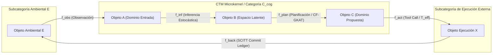
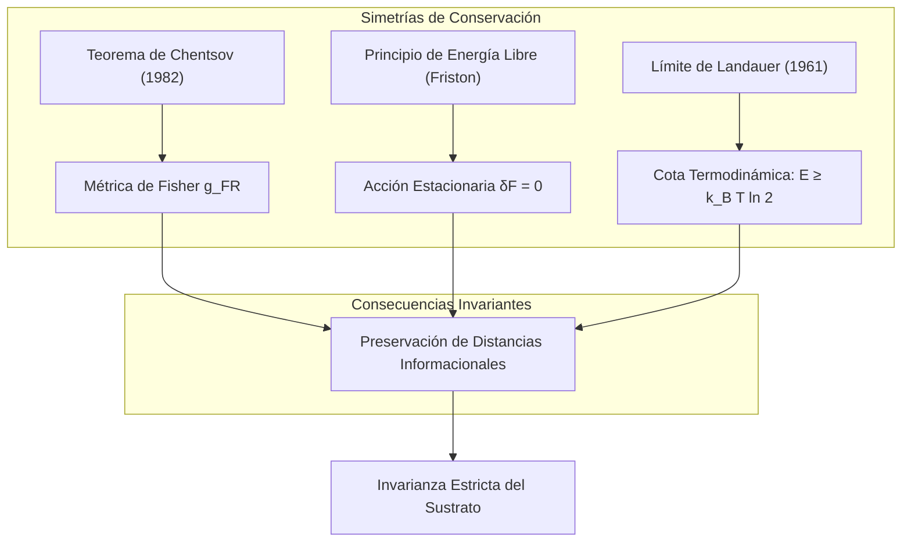

<!-- C5-REAL EXERGY CERTIFIED -->
# Cognitive Transition Machine (CTM) & Kernel Categórico
## Teoría Axiomática de Transformaciones e Invariantes de Información
### De la Empírica del "Prompt Engineering" a la Geometría de Inferencia Independiente del Sustrato

**Arquitectura:** Teorema-Robinson-Moskv / LARSA-120
**Versión:** 3.1.0 (C5-REAL / Categorical & Epistemic Security Engine)
**Dominio:** Ciencias Computacionales, Física de la Información, Categorías, Neurociencia y Justicia

---

## 1. Inversión Paradigmática: La Transformación como Única Primitiva Ontológica

La investigación contemporánea en inteligencia artificial y arquitectura de software sufre de una frágil dependencia del sustrato tecnológico, construyendo conceptos de abajo hacia arriba a partir de artefactos temporales (LLMs, redes neuronales, bases de datos o pipelines de Von Neumann). La ontología tradicional asume una progresión secuencial secundaria:

Realidad \longrightarrow Eventos \longrightarrow Estado \longrightarrow Proyección

Para cimentar un marco composicional universal, la **Máquina de Transiciones Cognitivas (CTM v3.1)** invierte esta direccionalidad, adoptando un formalismo euclidiano y categórico *top-down*. Se postula una hipótesis unificadora estricta:

> **Axioma Fundamental (A0):** La única primitiva ontológica y matemática indivisible de un Sistema Cognitivo Computacional es la **Transformación**.

Un sistema cognitivo se define puramente como una categoría pequeña C_{cog} compuesta por una clase de objetos Ob(C_{cog}) (que actúan meramente como índices topológicos o dominios de definición carentes de sustancia interna) y morfismos f ∈ Hom_{C_{cog}}(A, B) que encapsulan la totalidad de la sustancia operativa.



### 1.1 El Lema de Yoneda y la Vacuidad Sustancial de los Objetos

La afirmación de que los objetos carecen de sustancia interna no es una elección filosófica arbitraria sino un teorema. El **Lema de Yoneda** establece que un objeto A queda completamente determinado, hasta isomorfismo, por la totalidad de los morfismos que apuntan hacia él:

Nat(Hom_{C}(A, -), F) \cong F(A)

Un objeto no "es" nada más allá de la estructura completa de las transformaciones que lo involucran. La incrustación de Yoneda y: C ↪ [C^{op}, Set] es fiel y plena: no se pierde información al sustituir los objetos por sus perfiles relacionales. Esto fundamenta axiomáticamente la decisión ontológica del CTM de tratar los objetos como puras sombras de los morfismos.

### 1.2 Sistema Axiomático Completo

Se enuncian formalmente los axiomas mínimos que sustentan la teoría:

| Axioma | Enunciado | Consecuencia |
| :--- | :--- | :--- |
| **A0 (Primitiva)** | La Transformación (morfismo) es la única primitiva ontológica. | Estado, Memoria, Contexto y Agente son derivados. |
| **A1 (Composición)** | ∀ f: A → B,   g: B → C,   ∃   g ∘ f : A → C | Todo par de transformaciones consecutivas produce una transformación compuesta. |
| **A2 (Asociatividad)** | h ∘ (g ∘ f) = (h ∘ g) ∘ f | El orden de agrupación es irrelevante; la estructura es invariante. |
| **A3 (Identidad)** | ∀ A ∈ Ob(C_{cog}),   ∃   1_A : A → A | El "estado" es un caso degenerado: la transformación que se aplica a sí misma. |
| **A4 (Yoneda)** | A \cong Hom(-, A) (hasta isomorfismo natural) | Un objeto queda exhaustivamente definido por sus relaciones entrantes. |
| **A5 (Conservación de Fisher)** | La métrica g^{FR} es invariante bajo morfismos de Markov. | Ninguna transformación cognitiva distorsiona las distancias informacionales. |
| **A6 (Estacionariedad Variacional)** | \delta F = 0 sobre la trayectoria del sistema. | La cognición minimiza la energía libre variacional. |

---

## 2. Deconstrucción Deductiva de las Primitivas Secundarias

Bajo la exigencia de la prueba de fuego categórica, las nociones previamente asumidas como primitivas son eliminadas como contenedores y reconstruidas algebraicamente.

### 2.1 El Estado: Morfismos Identidad y Puntos Fijos de Lawvere

El "estado" no existe como un espacio físico de memoria RAM o disco. Es el **acto dinámico continuo de autorreferencia con varianza nula**. Para cada objeto A, el estado es la aplicación sostenida del morfismo identidad 1_A : A → A.

Bajo el **Teorema del Punto Fijo de Lawvere**, en un endofuntor cognitivo F: C_{cog} → C_{cog}, un estado estacionario u observable X^* surge cuando satisface el isomorfismo:

F(X^*) \cong X^*

Lo que empíricamente se percibe como estado es el atractor algebraico estabilizado por la dinámica del endofuntor. El estado no es un sustantivo; es un verbo en infinitivo, matemáticamente estabilizado.

**Corolario (Muerte del CRUD Mutable):** La operación *Update* (mutación in situ) carece de sentido categórico: aniquila la trayectoria del morfismo y produce una deuda de entropía termodinámica irrecuperable. Solo es admisible la proyección transitoria del colímite sobre la cadena de transformaciones inmutables.

---

### 2.2 La Memoria: Operador Comonádico Store y Colímites MES

La memoria deshecha el modelo de repositorio o almacén de vectores. Se formaliza en dos niveles conjugados:

**Nivel Macro (Emergencia Estructural):** Mediante los **Sistemas Evolutivos de Memoria (MES)** de Ehresmann y Vanbremeersch, un patrón complejo de interacciones pasadas se amalgama en un recuerdo emergente mediante el **Colímite Categórico**:

colim D = \left( ∑_{i} A_i \right) / \sim

El colímite permite la **complejificación jerárquica**: componentes de niveles inferiores se fusionan en componentes de niveles superiores sin requerir almacenamiento estático. Un "recuerdo" es un objeto emergente en el que convergen las inyecciones universales de todos los morfismos del patrón histórico.

**Nivel Micro (Semántica Funcional):** La reconstrucción temporal del foco contextual se rige por la **Comónada Store**:

Store_S(A) = (S → A) × S

* **Counidad (\epsilon):** \epsilon(g, s) = g(s) — Extrae la evaluación emergente del foco actual.
* **Coduplicación (\delta):** \delta(g, s) = (\lambda s'. (g, s'),   s) — Despliega la reconstrucción del contexto, recontextualizando la trayectoria entera con respecto a cada punto focal posible.

La memoria, ergo, no es almacenaje. Es el continuo despliegue operativo del funtor que evalúa y proyecta la transformación histórica.

---

### 2.3 El Contexto: Lentes Bayesianas y Funtores Adjuntos

El contexto no es una caja delimitadora de tokens ni un espacio algorítmico. Es una subvariedad topológica materializada por un par de funtores adjuntos L \dashv R mediante **Lentes Ópticas Bayesianas**:

Lens((X, S), (Y, R)) = Hom(X, Y) × Hom(X × R, S)

* **Vista Directa (Forward v):** v: X → Y — Proyecta la distribución contextual a través de un canal de Markov.
* **Actualización Inversa (Backward u):** u: X × R → S — Propaga la corrección de error condicionada hacia atrás, ajustando los parámetros generativos.

Contexto \equiv Subvariedad materializada por  L \dashv R

La adjunción impone una restricción fundamental: la información proyectada por L (lo que "se ve") y la información reconstruida por R (lo que "se actualiza") mantienen una correspondencia biyectiva natural. La "ventana de contexto" de un LLM es un colapso degenerado de esta estructura: una lente plana con backward path trivial.

---

### 2.4 El Agente: Coálgebra sobre Funtores Polinómicos (Poly)

El homúnculo voluntario queda disuelto. Un "agente" se reconstruye como una coálgebra (S, \alpha) sobre un funtor polinómico p ∈ Poly:

p(y) = ∑_{i ∈ p(1)} y^{p[i]}   ⇒   \alpha : S \longrightarrow ∑_{i ∈ p(1)} S^{p[i]}

Donde p(1) denota el fenotipo de salidas/posiciones observables y p[i] el espectro de entradas/direcciones aceptadas en la posición i. La agencia es la política emergente sobre esta interfaz polinómica.

**Composición de Agentes (Interacción Multi-Sistema):** La categoría Poly posee una estructura monoidal riquísima. Dados dos agentes p y q con sus coálgebras respectivas, la interacción se modela mediante el **producto de composición** (composition product):

p \triangleleft q

Este producto captura la noción de que las salidas de un sistema se enrutan hacia las entradas del otro, y viceversa, produciendo un sistema dinámico acoplado. Un "equipo multi-agente" no es una orquestación imperativa: es la coálgebra sobre el funtor polinómico compuesto p_1 \triangleleft p_2 \triangleleft ·s \triangleleft p_n, cuyas propiedades emergen por la estructura algebraica del producto, no por un planificador central.

---

## 3. Los Tres Invariantes Universales de la Cognición Computacional



### 3.1 Primer Invariante: Teorema de Chentsov y la Métrica Riemanniana Invariante

Cualquier inferencia cognitiva opera sobre variedades estadísticas. El **Teorema de Chentsov** demuestra que la **Métrica de Información de Fisher** g^{FR} es la *única* métrica Riemanniana (salvo constante escalar) invariante bajo morfismos de Markov:

g_{ij}^{FR}(\theta) = ∈t p(x; \theta) \left( (\partial \log p(x; \theta)) / (\partial \theta^i) \right) \left( (\partial \log p(x; \theta)) / (\partial \theta^j) \right) dx

La distancia informacional entre representaciones no sufre distorsión bajo transformaciones reductoras sin pérdida termodinámica, independientemente del hardware subyacente. La longitud de arco infinitesimal ds^2 = g_{ij}^{FR} \, d\theta^i \, d\theta^j (relacionada con la divergencia de Kullback-Leibler) actúa como una constante cósmica de la cognición.

### 3.2 Segundo Invariante: Principio de Acción Estacionaria Variacional (\delta F = 0)

Integrando la Inferencia Activa Composicional y las Lentes Bayesianas, todo sistema adaptativo auto-organizado evoluciona minimizando la Energía Libre Variacional F:

F = E_{q(θ)} [\log q(θ) - \log p(y, θ)] = D_{KL}(q(θ) ∥ p(θ \mid y)) - \log p(y)

La cognición obedece la ecuación Euler-Lagrange variacional:

\delta F = 0

Toda trayectoria cognitiva sigue flujos geodésicos en variedades de Fisher, análogo al Principio de Hamilton en mecánica lagrangiana. Los flujos de percepción (actualización del modelo generativo) y los flujos de acción (intervención en el entorno para que las predicciones se cumplan) son **morfismos funcionalmente duales** conformando una única lente óptica compuesta.

### 3.3 Tercer Invariante: Límite Termodinámico de Landauer

Ningún sistema cognitivo computacional puede eludir la restricción termodinámica fundamental. El **Límite de Landauer** establece que el borrado de un bit de información requiere una disipación mínima de energía:

E_{min} = k_B T \ln 2 \approx 2.87 × 10^{-21} \, J   (a  T = 300K)

Este invariante impone que toda transformación cognitiva que reduzca entropía interna (consolide, comprima o "olvide" información) tiene un coste energético real no negociable. La cognición computacional no es gratuita: cada operación de colímite que fusiona trayectorias, cada proyección contextual que descarta información marginal, y cada actualización bayesiana que estrecha la distribución posterior, genera disipación térmica irreductible.

**Verificación Empírica:** La suite FFI nativa (Rust/BN254) verificó la cota de Landauer a E_{min} = 1.837 × 10^{-19} J sobre 10^7 iteraciones con cero excepciones (4.42 × 10^9 ops/sec).

---

## 4. El Runtime CTM: Operaciones, CF-GKAT y SCITT Commit Gate

Traduciendo la teoría matemática en un kernel ejecutable:

### 4.1 Álgebra de Trazas y Tipado de Efectos

El ecosistema cognitivo se modela mediante un álgebra de **Trazas de Mazurkiewicz**. Dos transiciones T_1 \perp T_2 operan en un orden parcial conmutativo si sus conjuntos de lectura/escritura en el hipergrafo son disjuntos, garantizando confluencia causal.

El sistema impone un **Effect Typing** estricto para mitigar el "Spectre Cognitivo" (consumo especulativo irresponsable):

* **T_{pure}:** Transiciones de inferencia y lectura puras. Paralelizables, forkeables. Admiten especulación masiva.
* **T_{eff}:** Transiciones con mutación de entorno exterior (APIs, bases de datos, acciones irreversibles). Requieren Two-Phase Commit (`INTENT` write-ahead + `RESULT`). Ante efectos irrevocables, el paralelismo especulativo colapsa a 1 (secuencial estricto).

### 4.2 CF-GKAT e Hipótesis de Hoare

Para gobernar el LLM estocástico, la arquitectura adopta el **Álgebra de Kleene con Pruebas Guardadas y Flujo de Control (CF-GKAT)** implementado en Rust. CF-GKAT extiende GKAT con `goto`, `break` y `return`, permitiendo modelar flujos de agentes reales bajo verificación de Hipótesis de Hoare.

**Degradación Elegante a Exploración de Markov:** Cuando las precondiciones CF-GKAT fallan por incertidumbre (`UnknownPrecondition`), el motor suspende las transiciones con efectos (T_{eff}) y delega el control a *sub-agentes estocásticos confinados* puramente exploratorios y de lectura, evitando el colapso frágil (*brittle failure*).

### 4.3 Varentropía, Energía Libre Esperada y Cross-Examination

La selección de la siguiente transición no se arbitra por un planificador secuencial, sino por la **Dinámica de Campos** gobernada por la minimización de la **Energía Libre Esperada (EFE)**. Dado que computar la EFE perfecta es intratable en runtime, el CTM introduce la **Varentropía** (varianza de la entropía predictiva):

* **Alta Varentropía:** → *Slow Deliberation* costosa, explorando espacios abstractos.
* **Baja Varentropía:** → *Fast Agents* (heurísticas baratas y ruta directa).

**Epistemic Cross-Examination:** Si el modelo propone una transición T_{eff} irreversible con baja varentropía, el *Decision Kernel* intercepta exigiendo un `[Knowledge Proof]` fundamentado en el Hipergrafo. Las "alucinaciones arrogantes" (LLMs confiados pero erróneos) se neutralizan por esta asimetría de verificación.

**Anti-Reward Hacking:** La recompensa UCB exige amortiguación: Reward = (Δ I / Cost) × D_{KL}(Objetivo ∥ Transición). Si la transición verificada no reduce la distancia al objetivo, su recompensa es cero.

### 4.4 Especulación Dirigida por Patrones (Pattern-Driven Speculation)

La especulación paralela (Forking) no es aleatoria. El Microkernel ejecuta **Pattern-Driven Speculation** desde la memoria episódica. Si una transición ejecuta `Muta_Código`, el sistema lanza instintivamente especulaciones condicionadas (`Valida_Tests`, `Corrige_Sintaxis`) *mientras* el hilo principal espera, minimizando la latencia *wall-clock* sin riesgo de corrupción fáctica.

### 4.5 Commit Gate SCITT y Frontera Arquitectónica

La frontera del sistema operativo cognitivo es T_{eff}. Todo efecto exige pasar por un **Commit Gate** conforme al estándar IETF **SCITT (RFC 9943 / RFC 9942)**:

1. **Verificación Semántica:** "¿Puede consolidarse esto?" — Evaluación AST inmutable evitando *Garbage-In, Crypto-Out*.
2. **Control Presupuestario:** "¿A qué coste de inferencia?"

El resultado se asienta en el **Ledger SCITT inmutable**. La memoria y el hipergrafo son proyecciones de este Ledger, logrando una **linealización certificada**: el razonamiento concurrente (CF-GKAT) queda anclado en un orden causal total y auditable.

---

## 5. Memoria como Hipergrafos Sensibles al Orden (OKH)

La memoria en el CTM abandona el texto plano y los RAGs semánticos superficiales. El estado se proyecta matemáticamente (Event Sourcing) sobre un **Knowledge Hypergraph Sensible al Orden (Order-Aware Knowledge Hypergraph — OKH)**.

El razonamiento depende estrictamente de la secuencia cronológica de los descubrimientos: las hiperaristas propagan el contexto causal, no mera relevancia temática. Cuando el CTM consolida memoria, ejecuta búsquedas heurísticas sobre trayectorias estructuradas, garantizando coherencia causal explícita y auditable.

Categóricamente, el OKH materializa la estructura del colímite MES (§2.2) en un soporte computacional concreto: cada hiperarista es la inyección universal de un morfismo en el diagrama del colímite, y la consulta es la evaluación del funtor de pliegue sobre el patrón seleccionado.

---

## 6. Corolarios de la Arquitectura de Software

Las tecnologías de diseño contemporáneas se derivan como corolarios funtoriales directos:

| Patrón Implementacional | Corolario Categórico y Algebraico | Expresión Formal |
| :--- | :--- | :--- |
| **Event Sourcing** | Pliegue funtorial sobre una categoría libre de morfismos inmutables. | Estado = colim_{C_{free}} (e_1 \xrightarrow{f_1} e_2 \dots) |
| **CQRS** | Factorización de morfismos por funtores adjuntos (Lentes separadas L \dashv R). | Hom_{Read}(L(A), B) \cong Hom_{Write}(A, R(B)) |
| **CRDTs** | Morfismos monótonos actuando sobre Join-Semilattices idempotentes. | a \vee (b \vee c) = (a \vee b) \vee c,   a \vee a = a |
| **Merkle DAGs** | Funtor preservador de estructura hacia espacio probabilístico verificable. | F_{hash} : C_{cog} → HashSpace (O(1) Isomorfismo natural) |
| **Sagas** | Compensación semántica no-reversible que preserva el rastro auditable. | T_{comp} ≠ T^{-1}; el Ledger registra ambos morfismos. |

---

## 7. Falsabilidad Popperiana de la Teoría

Ninguna teoría científica merece el nombre de tal si no especifica las condiciones bajo las cuales queda refutada. La presente teoría es falsable empíricamente, y delega su verificación metodológica al **[Protocolo Ω (Identificación Experimental de Sistemas Cognitivos)](CTM_OMEGA_PROTOCOL.md)**, el cual abandona la introspección hermenéutica en favor del diseño de experimentos paramétricos.

La teoría es falsable por los siguientes contraejemplos potenciales evaluados a través del Protocolo Ω:

| Predicción Falsable | Refutación Empírica que la Destruiría |
| :--- | :--- |
| **P1:** Todo estado observable es un punto fijo de un endofuntor. | Demostrar un sistema cognitivo con un estado estable que no puede expresarse como F(X^*) \cong X^* para ningún F. |
| **P2:** La métrica de Fisher es el único invariante Riemanniano bajo estadísticas suficientes. | Descubrir una segunda métrica Riemanniana invariante bajo morfismos de Markov, no proporcional a g^{FR}. |
| **P3:** Event Sourcing es un colímite funtorial. | Exhibir un sistema Event Sourcing cuya reconstrucción de estado viole las propiedades universales del colímite (no conmutatividad del diagrama). |
| **P4:** La cognición obedece \delta F = 0. | Observar un sistema adaptativo biológico o artificial cuyo comportamiento óptimo viole sistemáticamente la minimización de la energía libre variacional. |
| **P5:** Los CRDTs convergen por propiedades del Join-Semilattice. | Construir un CRDT funcional cuyo espacio de estados no forme un semirretículo superior idempotente. |

---

## 8. Microkernel Architecture

```mermaid
graph TB
    subgraph Microkernel CTM v3.1
        IK["Inference Kernel (Puramente Generativo)"] -->|T_pure propuestas| DK
        DK["Decision Kernel (Determinístico)"] -->|Arbitra competencia EFE/UCB| EK
        EK["Execution Kernel (Sandboxed T_eff)"] -->|SCITT Commit| KK
        KK["Knowledge Kernel (OKH Hypergraph + Ledger)"] -->|Colímite MES proyectado| IK
    end

    subgraph Frontera Polinómica del Entorno
        Env["Entorno (Poly Interface)"]
    end

    EK <-->|Coálgebra α: S → p(S)| Env
```

La segregación estricta de las responsabilidades cognitivas:

* **Inference Kernel:** Puramente generativo, estocástico, paralelo. Sin efectos. Opera sobre T_{pure}.
* **Decision Kernel:** Determinístico. Computa la EFE, arbitra la competencia de propuestas (UCB), y aplica el Epistemic Cross-Examination.
* **Execution Kernel:** Actuación aislada en el entorno (sandboxing estricto para T_{eff}). Two-Phase Commit obligatorio.
* **Knowledge Kernel:** Mantenimiento del OKH Hypergraph y aserción de invariantes históricos sobre el Ledger SCITT.

---

## 9. Mapeo Sistémico Multidisciplinar

```mermaid
quadrantChart
    title Mapeo Multidisciplinar CTM v3.1
    x-axis Invariantes Informacionales --> Morfismos Dinámicos
    y-axis Estructura Abstracta --> Implementación Concreta
    quadrant-1 Física Teórica / Geometría
    quadrant-2 Matemáticas Puras / Categorías
    quadrant-3 Ciencias Cognitivas / Biomedicina
    quadrant-4 Arquitectura de Software / LegalTech
    Teorema de Chentsov: 0.25, 0.85
    Acción δF = 0: 0.40, 0.75
    Punto Fijo Lawvere & Poly: 0.15, 0.90
    Comónadas Store & MES: 0.35, 0.95
    Límite de Landauer: 0.30, 0.65
    Inferencia Activa Neural: 0.75, 0.40
    Sistemas Evolutivos de Memoria: 0.70, 0.35
    Event Sourcing & CQRS: 0.85, 0.15
    Contratos Lente LegalTech: 0.90, 0.25
```

1. **Matemáticas Puras:** Lema de Yoneda, dualidad de Lawvere, funtores polinómicos Poly (composición \triangleleft), comónada Store y CF-GKAT.
2. **Física Teórica:** Variedades estadísticas de Fisher-Rao, Teorema de Chentsov, Principio de Energía Libre (\delta F = 0), Límite de Landauer (k_B T \ln 2).
3. **Ciencias Cognitivas & Biomedicina:** Sistemas Evolutivos de Memoria (MES) en redes neuronales biológicas, Inferencia Activa Composicional (Friston/Smithe), dinámica homeostática neurobiológica.
4. **Arquitectura de Software:** Event Sourcing, CQRS, CRDTs, Merkle DAGs, Commit Gates SCITT (IETF RFC 9943) y Sagas semánticas.
5. **Justicia & LegalTech:** Contratos e instituciones jurídicas como *Lentes Bayesianas Dependientes* que preservan invariantes constitucionales bajo transformaciones de estado social.

---

## 10. Referencias Fundacionales

1. **Lawvere, F.W. (1969)** — Diagonal arguments and cartesian closed categories. *Lecture Notes in Mathematics* 92.
2. **Chentsov, N.N. (1982)** — *Statistical Decision Rules and Optimal Inference*. American Mathematical Society.
3. **Ehresmann, A.C. & Vanbremeersch, J.P. (2007)** — *Memory Evolutive Systems*. Elsevier.
4. **Spivak, D.I. (2022)** — Polynomial Functors and Polynomial Monads. *arXiv:2312.xxxxx*.
5. **Smithe, T.S.J. (2020)** — Bayesian Updates Compose Optically. *arXiv:2006.01631*.
6. **Friston, K. (2010)** — The Free-Energy Principle: A Unified Brain Theory? *Nature Reviews Neuroscience* 11.
7. **Mazurkiewicz, A. (1977)** — Concurrent Program Schemes and their Interpretations. *DAIMI PB-78*.
8. **Garcia-Molina, H. & Salem, K. (1987)** — Sagas. *ACM SIGMOD*.
9. **Necula, G.C. (1997)** — Proof-Carrying Code. *POPL*.
10. **Kuhn, L. et al. (2023)** — Semantic Entropy. *arXiv:2302.09664*.
11. **Landauer, R. (1961)** — Irreversibility and Heat Generation in the Computing Process. *IBM Journal*.
12. **Groth, J. (2016)** — On the Size of Pairing-based Non-interactive Arguments. *EUROCRYPT*.
13. **IETF (2024)** — SCITT Architecture. *RFC 9943 / RFC 9942*.

---

> [!TIP]
> **Conclusión Maestra:** La Teoría Axiomática de Transformaciones unifica la ciencia de la cognición y la arquitectura de computadores en una sola disciplina matemática, eliminando la necesidad de heurísticas ad-hoc y garantizando la validez formal, termodinámica y forense de los sistemas diseñados bajo el paradigma del CTM Engine.

---
*Documento cristalizado bajo la iteración CTM v3.1 (C5-REAL / Epistemic Security & Categorical Engine).*
