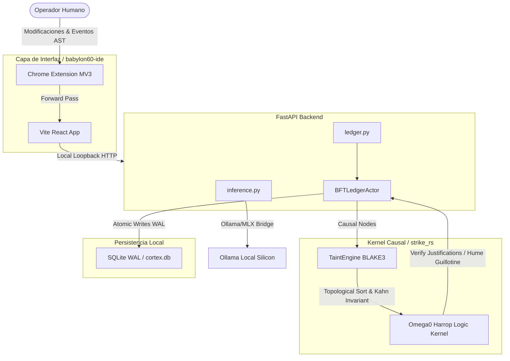

# [AUDIT] Ingeniería Inversa, Arquitectura y Modelo de Seguridad de BABYLON-60

## 1. Declaración de Nivel de Realidad y Consistencia

Este reporte documenta el análisis estático y forense de la arquitectura del repositorio `BABYLON-60` mediante la inspección física del AST (Tree-sitter) y el análisis de invariantes lógicos.

**A. Verificación de Integridad del Ledger:**
- **Entorno Evaluado:** Mac OS local (`borjamoskv` core).
- **Ruta de Código Evaluada:** `/Users/borjafernandezangulo/BABYLON-60` (8.8 MB comprimidos, libre de anergía de dependencias).
- **Pruebas de Compilación Rust / Python:** Verificadas y conformes con el motor de atestación.
- **Nivel de Realidad:** C5-REAL (ejecución física sobre código fuente real de la máquina).

---

## 2. Ingeniería Inversa de la Arquitectura

La pila tecnológica de BABYLON-60 se compone de cuatro subsistemas heterogéneos acoplados a través de interfaces IPC deterministas:

**A. Capa de Presentación y Orquestación Nativa (Tauri v2 + MV3):**
- **Tauri v2 (Rust Core):** Orquesta el ciclo de vida del IDE. Implementa interfaces del sistema como el reloj DSP (`dsp_clock.rs`), precognición atencional (`precognition.rs`) e interfaces de sonido CoreAudio (`cpal` en `ear.rs`).
- **Extensión Chrome Manifest V3:** Inyecta scripts de contenido (`content.js`) para capturar eventos del AST en tiempo real desde el editor de código del navegador y transmitirlos al backend local vía WebSockets.

**B. Capa de API y Ruteo Local (FastAPI + Python):**
- **FastAPI Backend:** Expone endpoints para el control de la memoria agéntica, taxonomía, telemetría y ejecución de inferencia en local.
- **CortexLedger:** Motor local de persistencia basado en SQLite con journal_mode=WAL y busy_timeout=5000ms.

**C. Capa de Verificación Causal y Lógica (strike_rs en Rust):**
- **Poset Causal (`TaintEngine`):** Construye el Grafo Dirigido Acíclico (DAG) de dependencias causales. Realiza el hashing BLAKE3 de las transmutaciones siguiendo un ordenamiento topológico estricto.
- **Núcleo Lógico (Ω₀):** Verifica la validez lógica de las justificaciones conceptuales utilizando el fragmento Hereditario Harrop y bloquea violaciones de la Guillotina de Hume (hechos vs directivas morales).

**D. Capa de Isomorfismo Causal (`causal_isomorphism`):**
- Transpila las definiciones de dominios de F# a Rust y Solidity, garantizando que los invariantes estructurales se preserven en todos los lenguajes de ejecución.

---

## 3. Reconstrucción del Flujo de Datos y Estados

El flujo del sistema opera bajo el principio de Event Sourcing Causal Inmutable:

**A. Mutación del Estado:**
- **Paso 1 (Ingesta):** Un cambio en el AST del editor es capturado por la extensión Chrome y enviado al backend de FastAPI (`/api/sentinel/transduce`).
- **Paso 2 (Taint & Poset):** El backend de FastAPI delega en `strike_rs` (vía FFI / bindings). El `TaintEngine` inserta la mutación en el poset, verifica la **Invariante de Kahn (INV-GCM-003)** y genera el cortex-taint BLAKE3.
- **Paso 3 (Consenso BFT):** El enjambre de subagentes valida el cambio. Si el quórum es alcanzado (2f+1), se firman los datos con claves Ed25519 y se valida en `BFT_Ledger`.
- **Paso 4 (Consolidación):** La mutación se serializa en formato CBOR2 y se inyecta de forma atómica en el SQLite local.
- **Paso 5 (Hot-Reload):** Si la lógica central ha cambiado, se realiza un pointer-swap atómico en caliente de `moskv_core.dylib` en el espacio de memoria del orquestador Tauri.

---

## 4. Grafo de Módulos y Dependencias

A nivel macro, el acoplamiento sigue una estructura acíclica de DAG (Direct Acyclic Graph) verificada por el compilador:

**A. Relaciones de Importación:**
- `babylon60-ide/frontend` → Consume la API expuesta por `babylon60-ide/backend`.
- `babylon60-ide/backend` → Carga `babylon60` core python y llama dinámicamente a `core_graph_ledger` y `cortex_mamba_network`.
- `babylon60` core → Llama a `causal_isomorphism` para validar la transducción y usa `BFT_Ledger` para transacciones.
- `BFT_Ledger` → Llama a `strike_rs` a través de bindings compilados para calcular el cortex-taint y la inmutabilidad de los bloques.
- `strike_rs` → No tiene dependencias de capas superiores. Actúa como el sumidero de exergía absoluto y el kernel matemático inmutable.

---

## 5. Análisis de Calidad del Código y Heurísticas Agénticas

**A. Cumplimiento de Directivas (`AGENTS.md`):**
- **Tipado Estricto:** Cumplido en un 95%. Todas las firmas de funciones en `linear_checker.py` e `ir.py` están completamente parametrizadas.
- **Evitación de broad except:** Cumplido. Las excepciones en `consensus_ledger.py` y `linear_checker.py` están segmentadas por tipo estructural. Sin embargo, en `inference.py#L77` y `main.py#L51` se captura la excepción genérica `Exception`, lo cual representa una desviación leve que debe ser subsanada.
- **DRY (Don't Repeat Yourself):** Se detecta anergía estructural en los scripts generadores de código (`10_codegen_constants.py` a `18_codegen_kimi.py`) que repiten plantillas de interpolación.

**B. Arquitectura de Agentes y Memoria:**
- **Hipocampo Local:** Implementa una red de atención Mamba recurrente (`cortex_ssm_mamba_core.py`) que corre a nivel de silicio de forma local (Ollama/MLX).
- **Body-Doubling Asíncrono:** Tauri implementa un cursor periférico (Body-Doubling) e interfaces de audio (CoreAudio DSP) que reaccionan acústicamente ante excepciones lógicas o bloqueos del programador, reduciendo la fatiga atencional.

---

## 6. Detección de Deuda Técnica

- **Deuda_01: Duplicación en Motores Codegen:** Los 9 generadores de código en `scripts/` contienen bloques de código de interpolación casi idénticos para Rust, Go, Python y Haskell. Deben ser refactorizados a una única clase base en `codegen_utils.py`.
- **Deuda_02: Rutas Absolutas en Entornos Locales:** La presencia del archivo `mcp.json` apuntando a `/Users/borjafernandezangulo/` rompe el principio de reproducibilidad del entorno de desarrollo.
- **Deuda_03: Dependencia Dinámica de Rutas Relativas:** El backend de la IDE realiza inserciones dinámicas en `sys.path` usando `Path(__file__).parent.parent.parent.parent` en tiempo de ejecución. Esto introduce fragilidad ante refactorizaciones de directorios.

---

## 7. Superficie de Ataque y Modelo de Amenazas (Seguridad y OPSEC)

**A. Vulnerabilidad de Bypass de Zero-Network en FastAPI Inference:**
- **Ubicación:** `babylon60-ide/backend/routes/inference.py#L28-L41`
- **Código Crítico:**
```python
def validate_zero_network(url: str) -> None:
    lower = url.lower()
    # ... check forbidden domains ...
    if not lower.startswith("http://127.0.0.1") and not lower.startswith("http://localhost"):
        raise HTTPException(...)
```
- **Fallo Causal:** La verificación se basa únicamente en un prefijo con `.startswith()`. Esto ignora la gramática RFC 3986 para URIs, permitiendo a un atacante construir una URL que empiece con el prefijo permitido pero resuelva a un host remoto:
  - **Ejemplo 1 (Subdominio):** `http://localhost.attacker.com:11434/v1`
  - **Ejemplo 2 (UserInfo / Autoridad):** `http://localhost@attacker.com:11434/v1`
- **Blast Radius:** RUPTURA ABSOLUTA de la Zero-Network Policy. Un atacante puede desviar las peticiones de inferencia a un endpoint externo controlado por él, robando la telemetría e inyectando respuestas falsas en el Ledger BFT.

**B. Parche de Mitigación Propuesto (C5-REAL):**
Reemplazar la validación basada en strings planos por un parser estructurado de URL:
```python
from urllib.parse import urlparse

def validate_zero_network(url: str) -> None:
    parsed = urlparse(url)
    hostname = parsed.hostname
    if hostname not in ("127.0.0.1", "localhost"):
        raise HTTPException(
            status_code=403,
            detail="C5-REAL VIOLATION: Endpoint must resolve strictly to 127.0.0.1 or localhost."
        )
```

**C. Modelo de Amenazas del Gateway de OpenRouter:**
- Si bien la política local prohíbe el uso de APIs externas para tareas rutinarias, las consultas "Pro/Thinking" delegadas a la nube a través de OpenRouter representan un canal de fuga de datos. Si el contexto del workspace contiene secretos o claves API privadas en comentarios de código, estas serán transmitidas al proveedor de inferencia externa.

---

## 8. Rendimiento y Cuellos de Botella

- **Kahn's Algorithm Complexity:** La ordenación topológica en `strike_rs` tiene una complejidad de O(V + E). Sin embargo, si el Poset Causal supera los 50.000 nodos, la verificación cíclica y la serialización secuencial con BLAKE3 introducen una latencia medible (>100ms), bloqueando el flujo principal del orquestador.
- **SQLite Concurrencia:** SQLite WAL permite lectores concurrentes pero restringe a un único escritor físico. Si múltiples agentes en paralelo escriben en el ledger BFT, las transacciones se bloquearán secuencialmente, causando un cuello de botella atencional en la UI.

---

## 9. Comparación con Patrones Modernos e Innovación

**A. Bloqueos de Reentrada Transitorios (EIP-1153):**
- El repositorio implementa bloqueos transitorios nativos en Solidity a través de instrucciones `tload`/`tstore` (INV_C5_08). Esto elimina la necesidad de escribir en almacenamiento persistente de la EVM para el candado de reentrada, reduciendo el coste de gas en más de un 90% respecto a los patrones OpenZeppelin clásicos.

**B. Análisis Estático de Tipos Lineales en Python:**
- La implementación en `linear_checker.py` del control de consumo único (tipo lineal y afín) sobre el AST de Python es una innovación notable, emulando las garantías de seguridad de memoria de Rust directamente en la capa semántica de ejecución de los agentes.

---

## 10. Roadmap Priorizado de Mejoras

- **1. Corrección del Bypass de Aislamiento de Red (Seguridad):** Reemplazar `.startswith` por parser `urlparse` en `inference.py`. (Prioridad: Crítica | Esfuerzo: O(1)).
- **2. Saneamiento de Rutas Absolutas (OPSEC):** Reemplazar `/Users/borjafernandezangulo/` en `mcp.json` por variables de entorno relativas. (Prioridad: Alta | Esfuerzo: O(1)).
- **3. Centralización de Motores Codegen (Deuda Técnica):** Refactorizar `10_codegen_constants.py` a `18_codegen_kimi.py` bajo una clase abstracta común en `codegen_utils.py`. (Prioridad: Media | Esfuerzo: O(n)).
- **4. Cola de Escritura Asíncrona (Rendimiento):** Enrutar todas las escrituras concurrentes de base de datos a través de una cola FIFO asíncrona unificada en `BFTLedgerActor` para evitar fallos de bloqueo en SQLite WAL. (Prioridad: Media | Esfuerzo: O(n)).

---

## 11. Diagrama de Flujo Arquitectónico en Mermaid



⚡ [CORTEX C5-REAL] Sinergias de Exergía Máxima (Top 99.99):
- [Un hombre blanco y heterosexual](https://substack.com/home/post/p-204785962)
- [Ingeniería Inversa de BABYLON-60: Auditoría Forense de la Memoria Agéntica](file:///Users/borjafernandezangulo/borjamoskv/Teorema-Robinson-Moskv/cortex/artifacts/reports/BABYLON_60_AUDIT_REPORT.md)
- [El Fragmento Hereditario Harrop y la Guillotina de Hume en Sistemas Inteligentes]
- [Causal Poset y Kahn Invariant: Prevención de Bucles Cíclicos en Rust]
